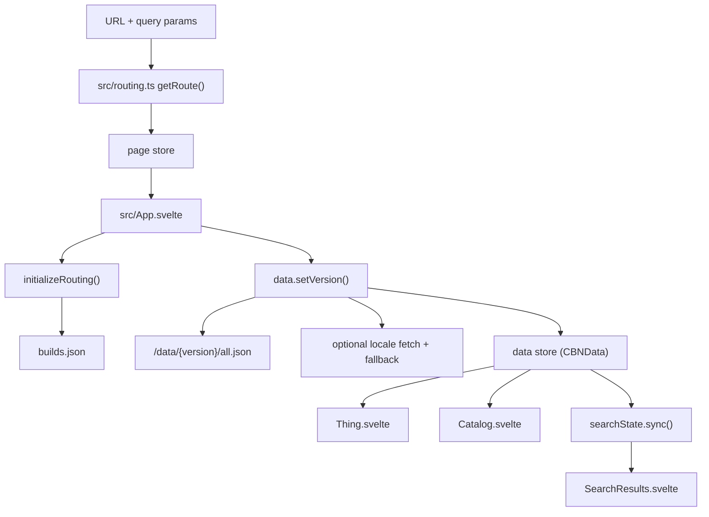

# Development Guide

## Overview

`cbn-guide` is a Svelte 5 + Vite 7 application that renders Cataclysm: Bright Nights
data from external JSON snapshots. The app is mostly a reader of a very large truth
that lives elsewhere. Its job is to load that truth, index it once, and let the URL
decide what should be visible.

Core constraints:

- The main data blob is large (`all.json` is roughly 30 MB), so the app prefers
  coarse reload boundaries over clever incremental mutation.
- The URL is the source of truth for routing and user-visible configuration.
- Svelte 5 runes are the reactive model.

Useful companion docs:

- [docs/architecture.md](docs/architecture.md)
- [docs/reactivity.md](docs/reactivity.md)
- [docs/routing.md](docs/routing.md)
- [docs/adr/README.md](docs/adr/README.md)

## Prerequisites

- Node.js: 24 recommended. Repository engines currently allow `^20.19.0 || >=22.12.0`.
- pnpm: 10.x
- Python: 3.x for image/font generation scripts such as `gen-ogimage.py` and
  `gen-unifont.py`
- `jq`: strongly recommended for inspecting `_test/all.json` without grepping the void

## Initial Setup

1. Install dependencies:

   ```bash
   pnpm install
   ```

2. Fetch fixtures for local testing and data inspection:

   ```bash
   pnpm fetch:fixtures
   ```

   For nightly fixtures:

   ```bash
   pnpm fetch:fixtures:nightly
   ```

3. Start the development server:

   ```bash
   pnpm dev
   ```

   Vite runs on [http://localhost:3000](http://localhost:3000) per
   `vite.config.ts`.

## Architecture Mental Model

### The Three UI Lifetimes

1. **Long-lived shell**

   `src/App.svelte` stays mounted and owns startup, routing sync, search input state,
   metadata updates, mod selector UI, and tileset persistence.

2. **Route-keyed detail/catalog views**

   `Thing.svelte` and `Catalog.svelte` are rendered behind a `{#key item}` block in
   `src/App.svelte`. When the route changes, they are destroyed and recreated. They
   should treat props as mount-time inputs, not as a stream to diff against.

3. **Fine-grained search results**

   `SearchResults.svelte` is intentionally **not** wrapped in a `{#key}` block. Search
   updates are frequent, and preserving DOM state is cheaper than remounting while the
   user types.

### Data Flow



### Why This Design Exists

- Version, language, tileset, and mod changes can imply a different dataset or asset
  universe. The code accepts this and uses hard reload boundaries where needed.
- Item and catalog pages are keyed so they can stay simple. The route change is the
  reset mechanism.
- Search stays unkeyed because remounting on every keystroke would waste work and
  disrupt the interface.

## Svelte 5 Reactivity Rules

This codebase is on Svelte 5 runes.

### `$state`

Use `$state` for mutable local UI state.

Real examples:

- `src/App.svelte`: `scrollY`, `builds`, `resolvedVersion`, modal state, metadata
- `src/LimitedList.svelte`: `expanded`
- `src/search-state.svelte.ts`: internal reactive search state object

### `$derived`

Use `$derived` for pure computed values with no side effects.

Real examples:

- `src/App.svelte`: `item` from `getRouteItem($page.route.target)`
- `src/SearchResults.svelte`: `results` and `matchingObjectsList`
- `src/LimitedList.svelte`: `initialLimit` and `realLimit`

Do not write to stores, touch the DOM, or mutate state inside `$derived`.

### `$effect` and `$effect.pre`

Use effects only for imperative synchronization.

Real examples:

- `src/App.svelte`: sync route changes into local `search`
- `src/App.svelte`: update document title and meta description
- `src/App.svelte`: call `searchState.sync(search, $data)`
- `src/App.svelte`: schedule derived-cache prewarming with `requestIdleCallback`

### Typed `$props()`

Component props should be typed explicitly.

```svelte
<script lang="ts">
import type { CBNData } from "./data";

interface Props {
  data: CBNData;
  search: string;
}

let { data, search }: Props = $props();
</script>
```

Do not use untyped `$props()` destructuring.

### Snippets and `{@render}`

Svelte 5 snippets are the preferred way to pass list/item rendering behavior.

Real examples:

- `src/LimitedList.svelte`
- `src/Catalog.svelte`
- `src/SearchResults.svelte`

Pattern:

```svelte
<LimitedList items={results} limit={25}>
  {#snippet children({ item })}
    <ItemLink type="item" id={item.id} />
  {/snippet}
</LimitedList>
```

Inside the reusable component:

```svelte
<li>{@render children?.({ item })}</li>
```

### `untrack` in Route-Keyed Components

`Thing.svelte`, `Catalog.svelte`, and several type views use `untrack(...)` to freeze
props at mount time. This is deliberate. In keyed pages, the route remount is the
update boundary.

Use `untrack` when:

- the component is mounted under a `{#key}` route boundary
- you want a stable local value or context input for that mount

Do not add effects that mirror props back into local state inside those keyed pages.

### Anti-Patterns

Avoid these:

- Svelte 4-style `$:` prop mirroring in `Thing.svelte`, `Catalog.svelte`, or their
  descendants
- side effects inside `$derived`
- `setContext(...)` inside a reactive effect
- legacy compatibility imports or patterns from `svelte/legacy`
- assuming all route-driven views are keyed; `SearchResults.svelte` is intentionally not

## Key Files and Responsibilities

| File                         | Responsibility                                                                                           | Important side effects                                                                                                 |
| ---------------------------- | -------------------------------------------------------------------------------------------------------- | ---------------------------------------------------------------------------------------------------------------------- |
| `src/App.svelte`             | Bootstraps the app, holds long-lived UI state, chooses which top-level view to render                    | calls `initializeRouting()`, calls `data.setVersion(...)`, updates document metadata, syncs search, handles navigation |
| `src/routing.ts`             | URL parsing, navigation helpers, version alias resolution, page store updates                            | uses `history.pushState`, `history.replaceState`, `location.href`, and `location.replace`                              |
| `src/data.ts`                | Fetches and builds `CBNData`, handles locale fallback, mod loading, flattening, indexing, derived caches | fetches external JSON, resets gettext locale, replaces the global `data` store                                         |
| `src/search-state.svelte.ts` | Search indexing and debounced result production                                                          | rebuilds index when `CBNData` changes, debounces search by `150ms` outside tests                                       |
| `src/Thing.svelte`           | Renders a single object view                                                                             | sets `data` context once per mount                                                                                     |
| `src/Catalog.svelte`         | Renders a type catalog grouped by domain-specific rules                                                  | sets `data` context once per mount                                                                                     |
| `src/SearchResults.svelte`   | Renders grouped search results without route-keyed remounting                                            | derives from `searchState.results` or injected `results`                                                               |
| `src/LimitedList.svelte`     | Reusable truncated-list UI using snippets                                                                | expands to full list in tests by using `Infinity`                                                                      |

## State Ownership

| State                       | Type                  | Owner                        | Scope     | Notes                                           |
| --------------------------- | --------------------- | ---------------------------- | --------- | ----------------------------------------------- |
| `page`                      | readable Svelte store | `src/routing.ts`             | global    | mirrors `location.href` and parsed route        |
| `data`                      | writable Svelte store | `src/data.ts`                | global    | replaced wholesale when a new dataset is loaded |
| `tileData`                  | store/helper module   | `src/tile-data.ts`           | global    | updated from `App.svelte` when tileset changes  |
| `searchState`               | rune-based singleton  | `src/search-state.svelte.ts` | global    | owns debounced query results                    |
| `search`                    | local rune state      | `src/App.svelte`             | shell     | synced from URL and user input                  |
| `item`                      | `$derived`            | `src/App.svelte`             | shell     | projected from `$page.route.target` via helper  |
| `builds`, `resolvedVersion` | local rune state      | `src/App.svelte`             | shell     | populated by `initializeRouting()`              |
| `expanded`                  | local rune state      | `src/LimitedList.svelte`     | component | UI-only disclosure state                        |

## Routing and Reload Boundaries

The routing system is hybrid by design.

### Soft navigation

Use SPA navigation for:

- internal item links
- catalog navigation
- search navigation
- browser back/forward

Mechanisms:

- `handleInternalNavigation(...)`
- `navigateTo(...)`
- `updateSearchRoute(...)`

`updateSearchRoute(...)` uses:

- `history.pushState(...)` when navigating away from an item page
- debounced `history.replaceState(...)` when editing a search URL in place

### Hard navigation

Use full reloads for:

- version changes
- language changes
- mod changes
- invalid legacy paths corrected by `initializeRouting()`

Mechanisms:

- `changeVersion(...)` writes `location.href`
- `updateQueryParam(...)` writes `location.href`
- `initializeRouting()` may call `location.replace(...)` to prepend `/stable/...`

## Working with Game Data

### Fixture Inspection

Never grep `_test/all.json`. Use `jq`.

Examples:

```bash
# Inspect one object
jq '.data[] | select(.id=="rock" and .type=="item")' _test/all.json

# List IDs for a type
jq '.data[] | select(.type=="item") | .id' -r _test/all.json
```

### Important Data Facts

- Raw game JSON often uses `copy-from`; missing fields may live in a parent object.
- `CBNData` handles flattening and indexing after fetch.
- Locale fallback is explicit: if a requested locale is missing, `data.setVersion(...)`
  falls back to English and `App.svelte` shows a warning.
- Active mods come from the URL, but unknown mod IDs are removed after the loaded dataset
  resolves the real active mod list.

## Testing

Prefer targeted tests first. Full render regressions are expensive and should be chosen
because the change deserves them, not because anxiety asked for a sacrifice.

### Recommended Workflows

- Tiny/localized change:

  ```bash
  pnpm test:changed --maxWorkers=50% --bail 1
  ```

- Normal feature or bugfix:

  ```bash
  pnpm lint
  pnpm check
  pnpm test:fast
  ```

- Cross-cutting data-model, routing, or rendering change:

  ```bash
  pnpm lint
  pnpm check
  pnpm gen:mod-tests
  pnpm vitest run src --maxWorkers=50% --bail 1
  ```

### Command Reference

#### Code Quality

- `pnpm lint`: runs `prettier -c .`
- `pnpm lint:fix`: runs `prettier -w .`
- `pnpm check`: runs `pnpm check:types`
- `pnpm check:types`: runs `svelte-check && tsc --noEmit`

#### Test Scripts

- `pnpm test`: runs `lint`, `check`, `gen:mod-tests`, then `test:full`
- `pnpm test:full`: runs `vitest run src`
- `pnpm test:fast`: excludes `src/all.*.test.ts` and `src/__mod_tests__/**`
- `pnpm test:render:core`: runs only the core render regression files
- `pnpm test:render:mods`: runs only generated mod render tests
- `pnpm test:changed`: runs `lint`, `check`, then `vitest run --changed --run`

### Important Test Files

- `src/all.*.test.ts`: renders large slices of the dataset to catch runtime/template
  failures
- `src/routing.test.ts`: routing and URL behavior
- `src/schema.test.ts`: schema validation against upstream data changes
- `src/data.test.ts`: `CBNData` behavior
- `src/search.test.ts`: search rendering and behavior
- `src/__mod_tests__/mod.*.test.ts`: generated per-mod render isolation tests

Why generated mod tests exist:

- rendering the mod matrix in a single worker is memory-heavy
- `pnpm gen:mod-tests` creates one Vitest file per mod
- isolated workers give memory a chance to die with dignity between runs

## Scripts

### Data and Assets

- `pnpm fetch:fixtures`: fetch default fixtures for local dev and tests
- `pnpm fetch:fixtures:nightly`: fetch nightly fixtures
- `pnpm fetch:builds`: fetch `builds.json`
- `pnpm fetch:icons`: fetch or render icon assets
- `pnpm gen:css`: generate palette CSS
- `pnpm gen:sitemap`: generate `public/sitemap.xml`
- `pnpm gen:ogimage`: generate the Open Graph image
- `pnpm gen:unifont`: subset Unifont for the current data

### Benchmarks

- `pnpm bench:node`
- `pnpm bench:browser`
- `pnpm bench:browser:batch`
- `pnpm bench:report`

### Transifex

- `pnpm i18n:push`: push extracted UI strings
- `pnpm i18n:download`: download existing translations to local JSON
- `pnpm i18n:upload`: upload updated translations from local JSON

Example workflow:

```bash
TRANSIFEX_API_TOKEN='1/...' pnpm i18n:download --out='./tmp/transifex-download'
# translate JSON files with your workflow
TRANSIFEX_API_TOKEN='1/...' pnpm i18n:upload --dir='./tmp/transifex-download'
```

Important boundary:

- Transifex extraction only sees literal `t("...")` calls
- dynamic expressions such as `t(variable)` do not create new extractable keys

## Common Maintenance Recipes

### Add UI-only local state

Use `$state` in the component that owns the interaction.

Good:

- disclosure state
- modal open/closed state
- loading spinners for a local async action

Bad:

- mirroring route props into local state inside `Thing.svelte` or `Catalog.svelte`

### Add a computed view of existing state

Use `$derived` when the value is a pure function of other state.

Good:

- filtered lists
- grouped search results
- derived limits or labels

Bad:

- DOM writes
- store writes
- async work

### Add a route-driven page behavior

1. Decide whether the behavior belongs to the long-lived shell or a keyed route page.
2. If it belongs to `Thing` or `Catalog`, prefer mount-time setup and `untrack(...)`.
3. If it belongs to the shell, react to `$page`, `search`, or `$data` with `$effect`.

### Add a new search presentation

1. Put indexing/search logic in `src/search-engine.ts` or `src/search-state.svelte.ts`.
2. Keep `SearchResults.svelte` focused on grouping and rendering.
3. Use snippets and `LimitedList.svelte` for repeated item rendering.
4. Do not wrap the whole search results tree in a `{#key search}` block.

### Change URL behavior safely

Use routing helpers instead of touching history directly from random components.

- `navigateTo(...)`: move to an item or catalog page
- `updateSearchRoute(...)`: keep search URL and UI in sync
- `updateQueryParamNoReload(...)`: update tileset-like URL state without reload
- `updateQueryParam(...)`: update params that require a full reload
- `changeVersion(...)`: switch data version with a hard navigation

### Add user-facing text

- Use `t` from `@transifex/native` for UI strings
- Use `src/i18n/gettext.ts` for game-data translations
- Keep extraction constraints in mind: literal `t("...")` strings are safest

### Add or change architectural behavior

If the change alters reload boundaries, routing authority, data lifetime, or mod
resolution semantics, add or update an ADR in `docs/adr/`.

## Limits and Edge Cases

- `SearchResults.svelte` is not keyed. Advice that assumes all top-level route views are
  remounted is wrong.
- `data` is replaced wholesale when a new dataset is loaded. Code that assumes
  incremental mutation of the active dataset will eventually lie to you.
- Search is debounced by `150ms` outside tests and by `0ms` in tests.
- `LimitedList.svelte` expands to `Infinity` during tests so hidden render failures do
  not evade the suite.
- `initializeRouting()` may rewrite invalid URLs with `location.replace(...)` before the
  app fully starts.
- Local storage access for tileset preference is wrapped in `try/catch` because browser
  security modes can deny it.
