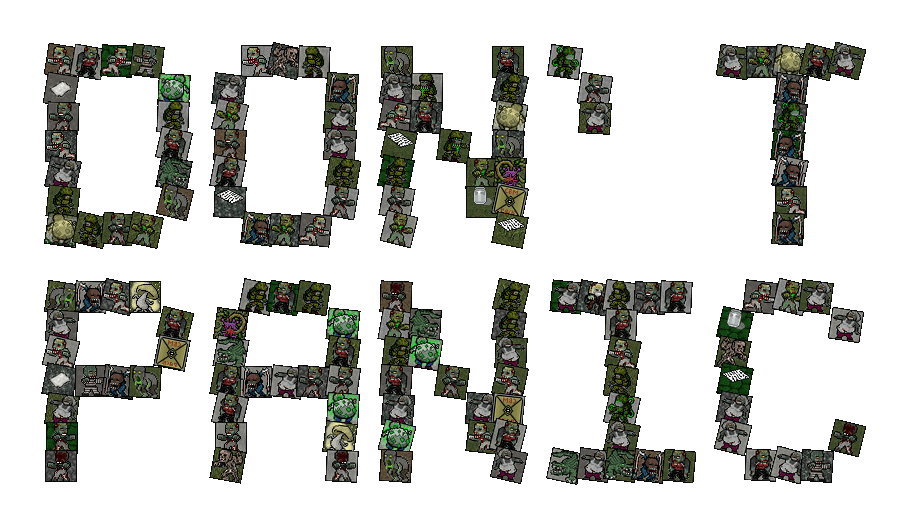

# The Hitchhiker's Guide to the Cataclysm: Bright Nights

**The Hitchhiker's Guide to the Cataclysm** is the essential, comprehensive companion to the zombie survival roguelike [Cataclysm: Bright Nights](https://github.com/cataclysmbnteam/Cataclysm-BN#readme).

Whether you're looking for the exact calorie count of a tainted lung or trying to figure out which bionic will stop you from being dissolved by acid, the Guide has you covered. Data is extracted directly from the game's JSON files, ensuring accuracy down to the last milliliter of mutagen.

[📕 **Open the Guide**](https://cataclysmbn-guide.com/)

## Features

- 🛠 **Up-to-Date**: Daily updates covering both **Stable** and **Nightly** builds.
- 🎨 **Visual Survival**: Full tileset support (UltiCa, UndeadPeople, RetroDays, and more) to see exactly what's about to bite you.
- 🛰 **Offline First**: PWA support means it works deep in a lab or a bunker. Visit it once, and it's yours forever—even without internet.
- 🔍 **Instant Search**: Cross-reference items, recipes, monsters, mutations, and bionics at terminal velocity.
- 🌍 **Multilingual**: Support for a vast array of languages, localized directly from the game's community translations.

## Acknowledgements

The Original Hitchhiker's Guide to the Cataclysm is maintained by [@nornagon](https://github.com/nornagon) on [GitHub](https://github.com/nornagon/cdda-guide).

This version is forked from the original and adapted for Cataclysm: Bright Nights by [@mythosmod](https://github.com/mythosmod), continued by [@ushkinaz](https://github.com/ushkinaz).

SVG icons are provided by [game-icons.net](https://game-icons.net/) under [CC BY 3.0](https://creativecommons.org/licenses/by/3.0/).

Further, thanks to everyone who files bugs and feature requests in the issue tracker. You all help make the Guide what it is!
