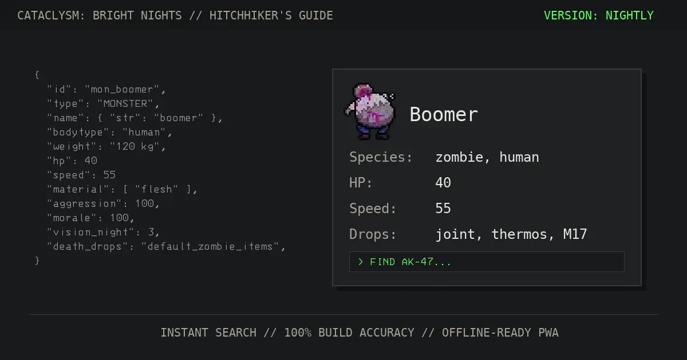

# The Hitchhiker's Guide to the Cataclysm: Bright Nights

**Parsed from the source data of [Cataclysm: Bright Nights](https://github.com/cataclysmbnteam/Cataclysm-BN#readme), for players who want raw numbers.**

If you check calories on tainted organs, compare UPS energy cost across CBMs, or want exact tool requirements before crafting a solar panel, this is the guide.

📕 [**Open the Guide**](https://cataclysmbn-guide.com/)

For a text-based terminal version, check out ⌨️ [**cbn-tui**](https://github.com/ushkinaz/cbn-tui); it is more suitable for modders.

---

## 🛡️ Hardcore Reference

The Guide is a solid reference for every survivor, from fresh spawns to seasoned veterans.

- **🔍 Search**: Items, recipes, monsters, bionics. Fast lookup across the full dataset.
- **🎨 Tilesets**: Supports **UltiCa**, **UndeadPeople**, **RetroDays**, and more for quick visual ID.
- **🛠️ Crafting Data**: Tool requirements, skill levels, and component alternatives.
- **🛰️ Offline Cache**: As a Progressive Web App (PWA), the Guide works even without internet access.
- **🌍 Builds**: Synced to **Stable** and **Nightly** data.
- **🌐 Localization**: Uses the game translation files.

---

## 🤝 Acknowledgements

Built by the community on top of a lot of prior work.

- **Foundations**: The original [Hitchhiker's Guide to the Cataclysm](https://github.com/nornagon/cdda-guide) was created and is maintained by [@nornagon](https://github.com/nornagon).
- **Adaptation**: This version was forked and adapted for _Bright Nights_ by [@mythosmod](https://github.com/mythosmod).
- **Evolution**: Development is currently continued by [@ushkinaz](https://github.com/ushkinaz).
- **Visuals**: Splendid SVG icons are provided by [game-icons.net](https://game-icons.net/) under [CC BY 3.0](https://creativecommons.org/licenses/by/3.0/).
- **Community**: A huge thanks to everyone who reports bugs, suggests features, and helps keep the Guide sharp.

---

## 🌐 Translation

The Guide follows Cataclysm's language coverage, and translation work is community-driven.

- **Game Data**: Automatically synchronized with official game translations.
- **Interface**: UI localization is crowdsourced and community-driven.
- **Join Us**: Help us reach 100% coverage on [Transifex](https://explore.transifex.com/cataclysmbn-guide/web-guide/). Thanks to everyone who contributes!

---

## ⚙️ Technical Details

Stack is Svelte + Vite. For the data pipeline and dev details:

- **Data Source**: Deep dive into game data is powered by our sister project, [cbn-data](https://github.com/ushkinaz/cbn-data).
- **Developer Info**: If you're a developer looking to contribute, please check out [DEVELOPMENT.md](DEVELOPMENT.md).

---

_“Don't Panic.”_
