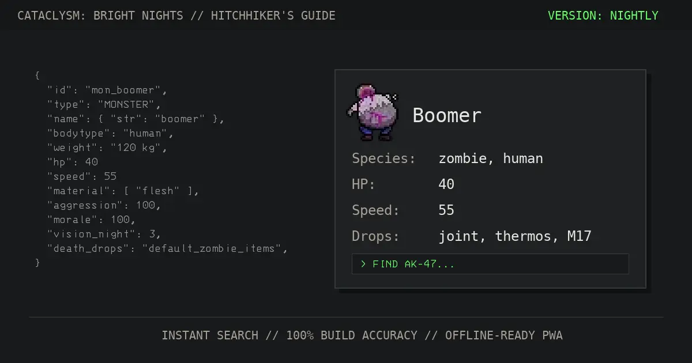

# The Hitchhiker's Guide to the Cataclysm: Bright Nights

Parsed from the source data of [Cataclysm: Bright Nights](https://github.com/cataclysmbnteam/Cataclysm-BN#readme).

If you check calories on tainted organs, compare UPS energy cost across CBMs, or want exact tool requirements before crafting a solar panel, this is the guide.

📕 [**Open the Guide**](https://cataclysmbn-guide.com/)

For modding – check out [**cata-bm**](https://github.com/ushkinaz/cata-bm). It runs locally using game data.

---

## Features

- Search for items, recipes, monsters, bionics. Fast lookup across the full dataset.
- Shows crafting info: tool requirements, skill levels, and component alternatives.
- Supports mods, including Aftershock, Magical Nights, DinoMod, 52 in total.
- Supports all in-repo tilesets: UltiCa, UndeadPeople, RetroDays, and the rest.
- As a Progressive Web App (PWA), the Guide works even without internet access.
- Uses the game translation files.

---

## Acknowledgements

- The original [Hitchhiker's Guide to the Cataclysm](https://github.com/nornagon/cdda-guide) was created and is maintained by [@nornagon](https://github.com/nornagon).
- Was forked and adapted for Bright Nights by [@mythosmod](https://github.com/mythosmod).
- Current development by [@ushkinaz](https://github.com/ushkinaz).
- SVG icons are provided by [game-icons.net](https://game-icons.net/) under [CC BY 3.0](https://creativecommons.org/licenses/by/3.0/).
- A huge thanks to everyone who reports bugs, suggests features, and helps keep the Guide sharp.

---

## Translation

The Guide follows Cataclysm's language coverage, and translation work is community-driven.

- Automatically synchronized with official game translations.
- UI localization is crowdsourced and community-driven.
- Help us [translate](https://explore.transifex.com/cataclysmbn-guide/web-guide/) the Guide.

---

## Technical Details

The main stack is Svelte + Vite. For the data pipeline and dev details:

- Game data is extracted, prepared and repackaged for web daily by a sister project [cbn-data](https://github.com/ushkinaz/cbn-data).
- Contribution guide can be found at [DEVELOPMENT.md](DEVELOPMENT.md).

---

_“Don't Panic.”_
