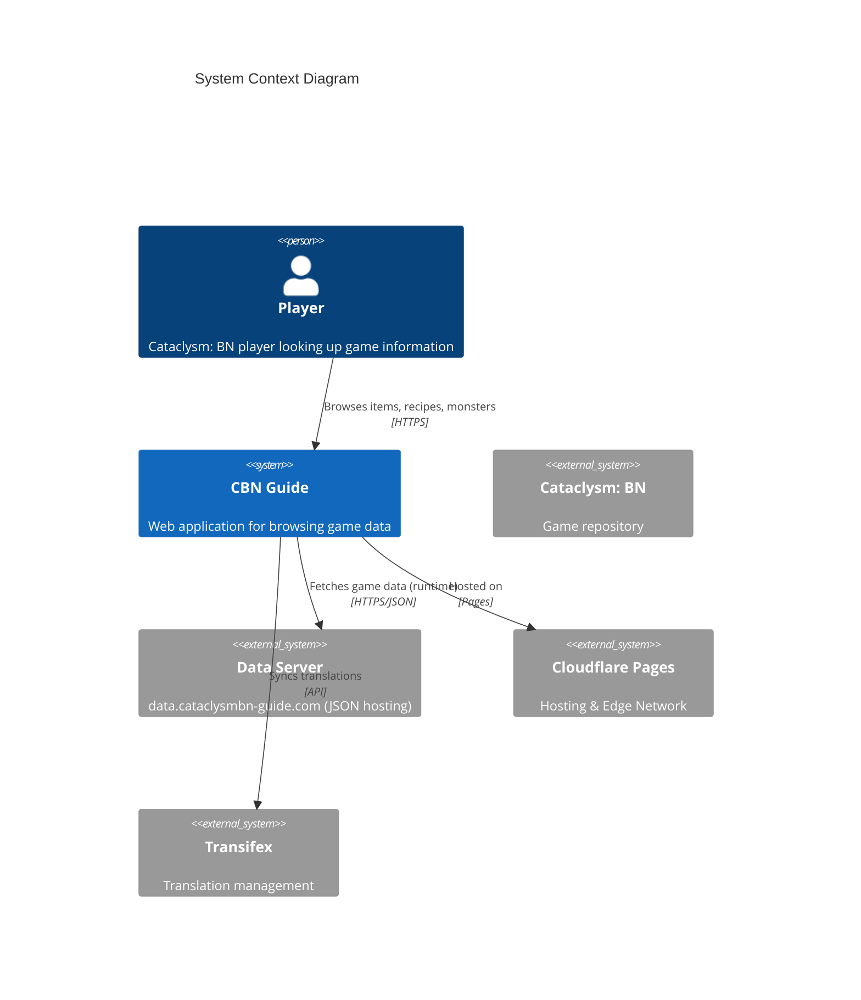
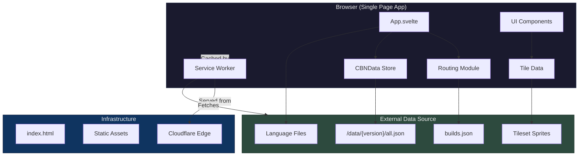
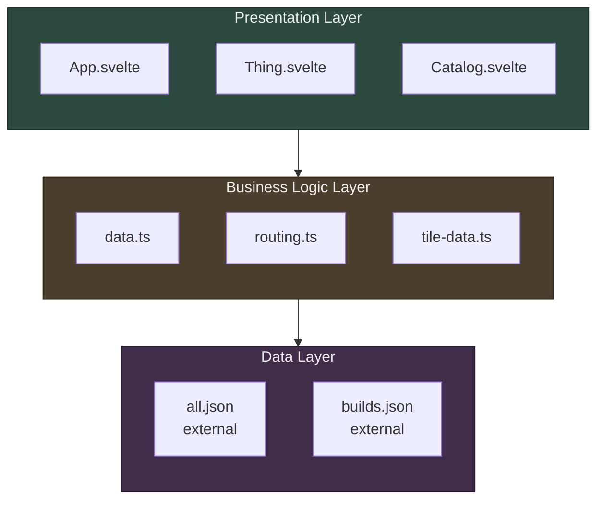
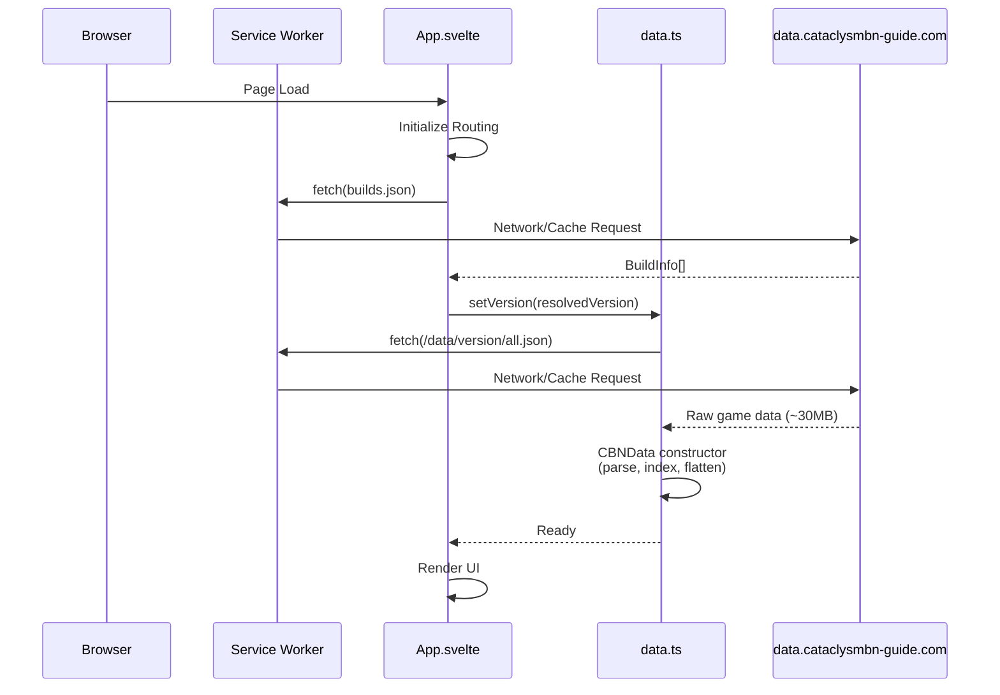
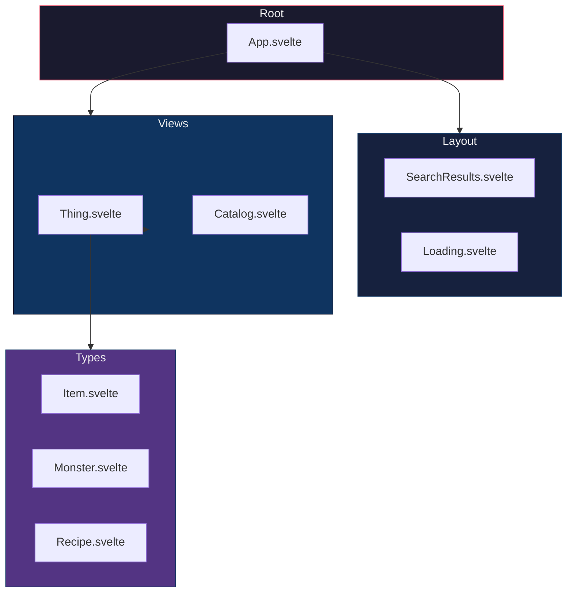
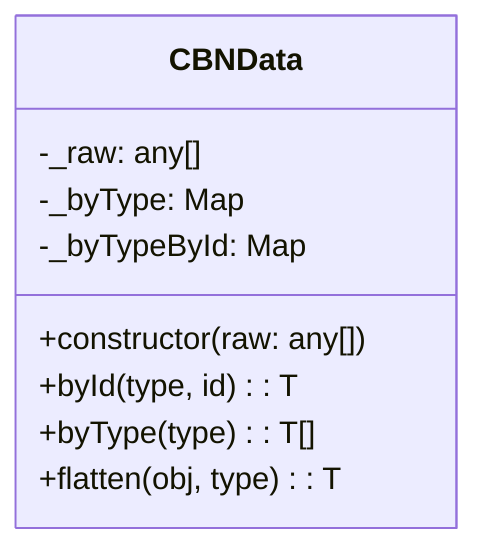
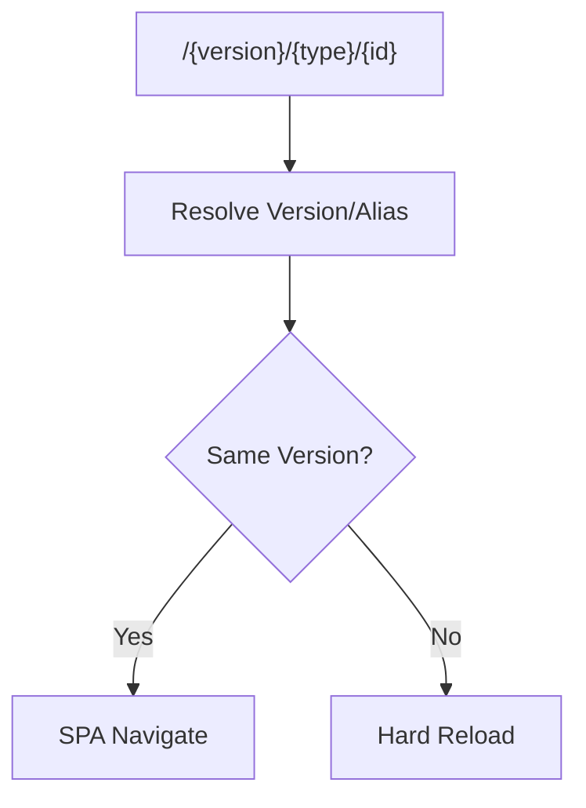
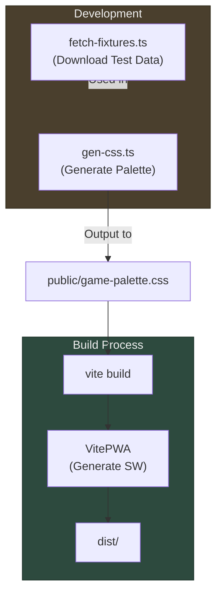

# Architecture Overview

This document provides a high-level architectural overview of the cbn-guide application — "The Hitchhiker's Guide to Cataclysm: Bright Nights."

## System Context



## High-Level Architecture



## Infrastructure & Deployment

The application is a purely static site (SPA) hosted on **Cloudflare Pages**.

- **Hosting**: Cloudflare Pages
- **Routing**: Client-side routing (SPA). Server-side routing rules configured via generic `_redirects` and `_headers`.
- **Configuration**:
  - `public/_headers`: Controls caching policies and preload headers.
  - `public/_redirects`: Manages version aliases (e.g., `/latest -> /nightly`) and legacy path redirections.
  - **Note**: No `wrangler.toml` is present; configuration is file-based or managed via Cloudflare Dashboard.
- **CI/CD**:
  - **GitHub Actions**: Runs tests (`pnpm test`), linting, and builds `dist` artifact for verification.
  - **Cloudflare Integration**: Automatically deploys the `dist` folder on push to `main` (via Cloudflare's git integration).

## Data & Caching Strategy

The application separates **Application Logic** (this repo) from **Game Data** (external).

### Source of Truth

All game data is hosted on `data.cataclysmbn-guide.com`. The app acts as a viewer for this external data.

### Runtime Caching (PWA)

We use `vite-plugin-pwa` (Workbox) to provide offline capability and efficient caching:

| Resource Type      | Pattern                   | Strategy                 | Rationale                                       |
| :----------------- | :------------------------ | :----------------------- | :---------------------------------------------- |
| **App Shell**      | `index.html`, `js`, `css` | **StaleWhileRevalidate** | Immediate load, update in background.           |
| **Build Index**    | `builds.json`             | **StaleWhileRevalidate** | Frequent updates, but stale is acceptable.      |
| **Nightly Data**   | `/data/nightly/*`         | **NetworkFirst**         | Nightly builds change daily; prefer fresh data. |
| **Stable Data**    | `/data/stable/*`          | **StaleWhileRevalidate** | Rarely changes.                                 |
| **Versioned Data** | `/data/v*`, `/data/20*`   | **CacheFirst**           | Immutable specific versions.                    |
| **Assets**         | Images, Fonts             | **CacheFirst**           | Long-term caching.                              |

### Data Generation (Development)

For local development and testing, scripts are used to fetch data snapshots:

- `fetch-fixtures.ts`: Downloads `all.json` to `_test/` for unit tests and local dev.
- `gen-sitemap.ts`: Fetches list of all items and generates `public/sitemap.xml`.
- `gen-css.ts`: Generates `public/game-palette.css` from `src/colors.ts` (Application defined colors).

## Application Layers



## Core Data Flow



## Component Architecture



## CBNData Class Structure



## Routing System

The routing system manages state primarily via the URL, supporting both SPA navigation and hard reloads for version switches.



## Development & Build Pipeline



## Technology Stack

- **Frontend**: Svelte 4, TypeScript, Vite
- **PWA**: vite-plugin-pwa, Workbox (Offline support)
- **Styling**: Scoped CSS, CSS Variables
- **Data**: External JSON (fetched runtime), copy-from inheritance, Transifex i18n
- **Infrastructure**: Cloudflare Pages
- **Testing**: Vitest, Puppeteer, svelte-check

## File Structure Overview

```
cbn-guide/
├── src/
│   ├── App.svelte          # Main application component
│   ├── data.ts             # CBNData class & utilities
│   ├── routing.ts          # URL routing logic
│   ├── tile-data.ts        # Tileset sprite management (ADR-001)
│   ├── assets/             # Static assets
│   └── ...
├── public/
│   ├── game-palette.css    # Generated game colors
│   ├── _headers            # Cloudflare headers config
│   ├── _redirects          # Cloudflare redirects
│   └── sitemap.xml         # Generated sitemap
├── scripts/
│   ├── fetch-fixtures.ts   # Fetch data for local dev/test
│   ├── gen-css.ts          # Generate CSS palette
│   └── gen-sitemap.ts      # Generate sitemap
├── docs/
│   ├── adr/                # Architecture Decision Records
│   └── architecture.md     # This file
└── _test/                  # Test fixtures (all.json)
```

## Related Documentation

- [Routing Architecture](./routing.md)
- [Reactivity Guide](./reactivity.md)
- [Development Guide](../DEVELOPMENT.md)
- [Architecture Decision Records](./adr/)
- [AGENTS.md](../AGENTS.md)
