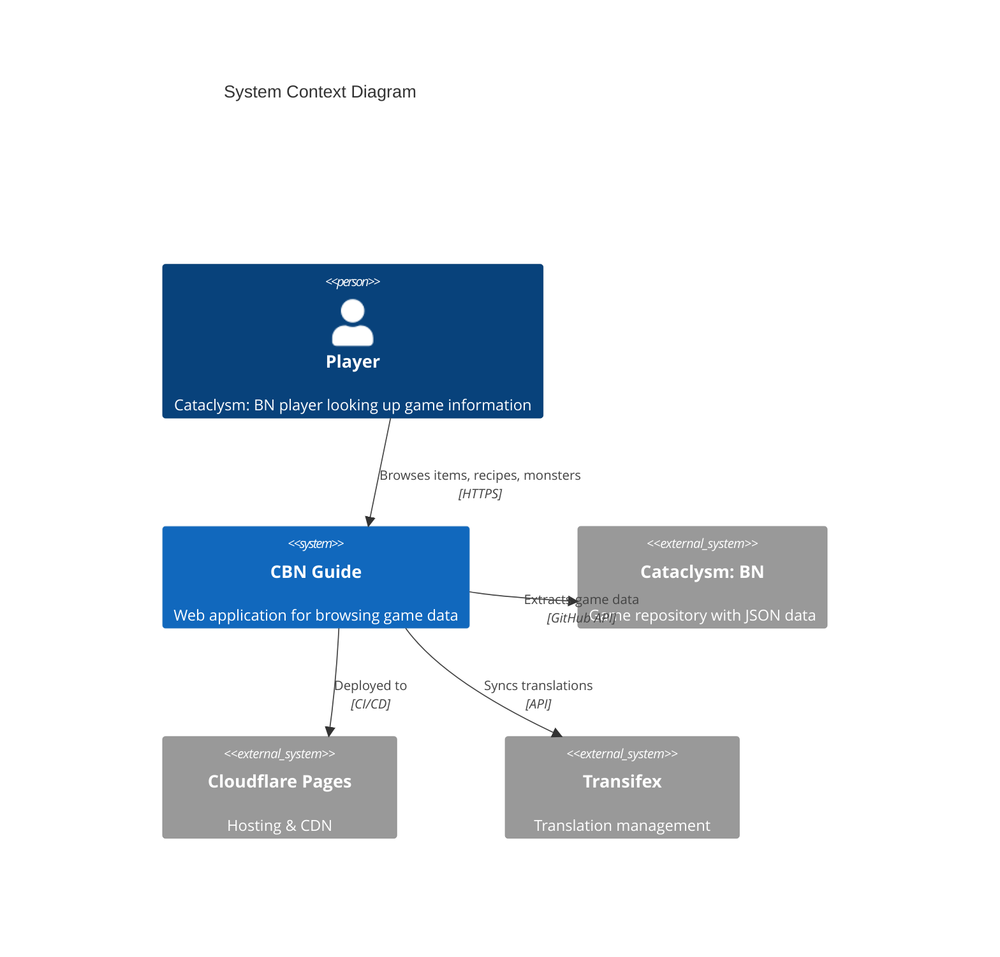
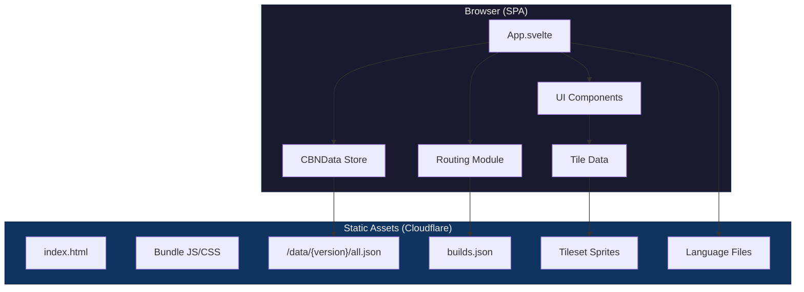
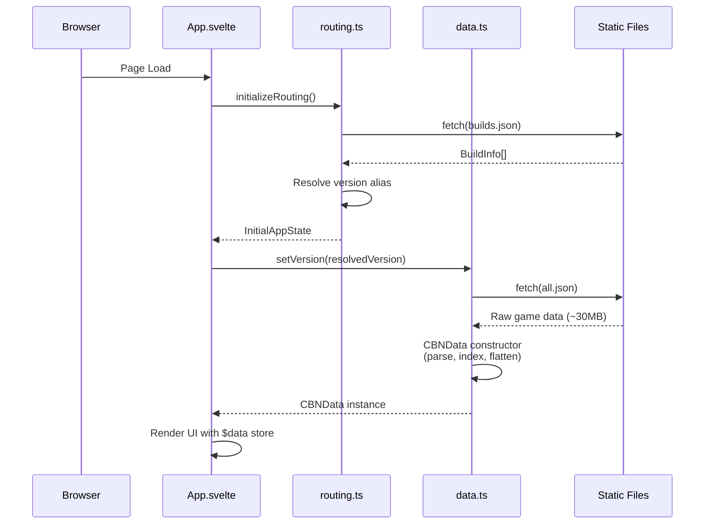
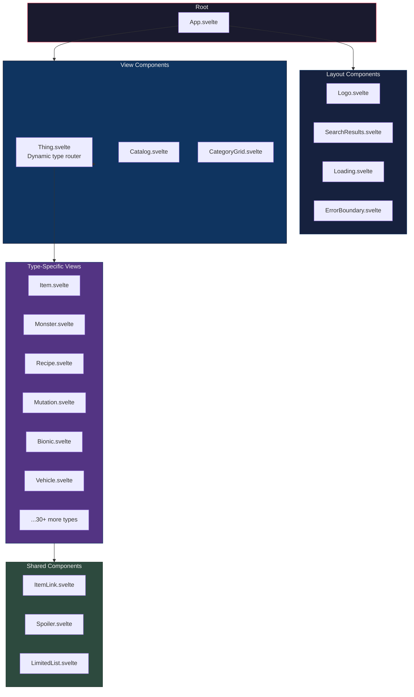
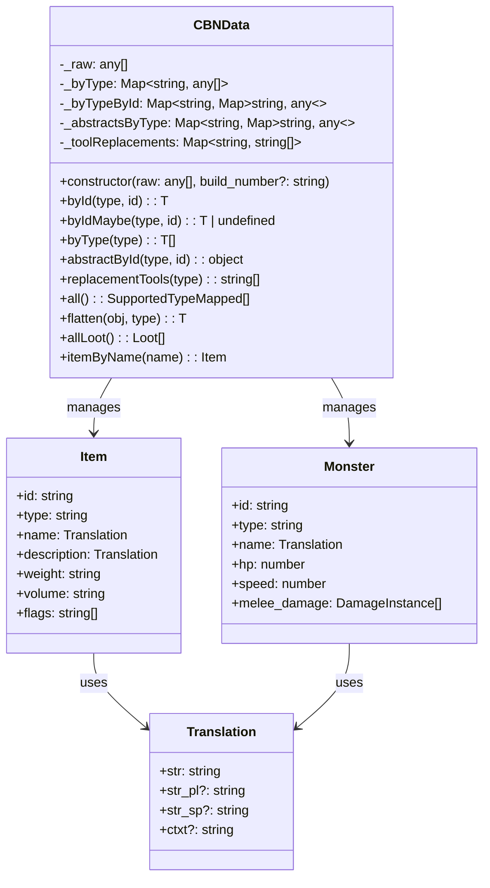
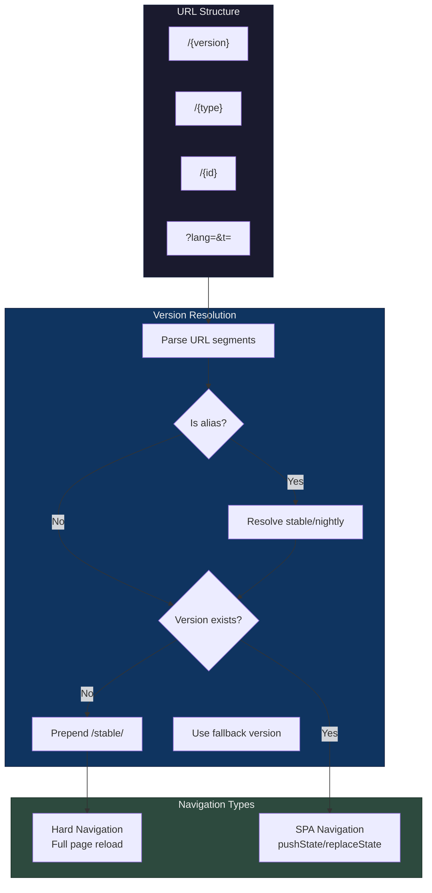
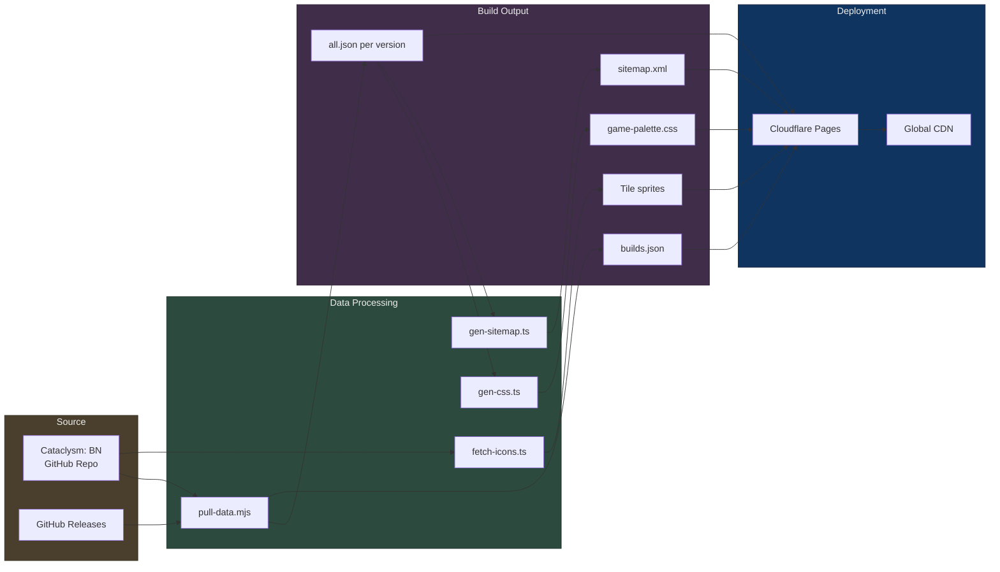
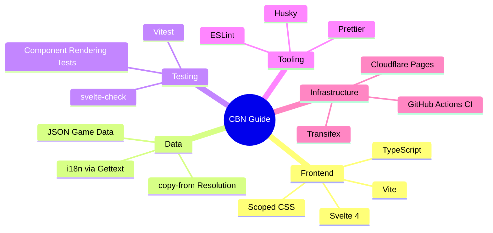

# Architecture Overview

This document provides a high-level architectural overview of the cbn-guide application — "The Hitchhiker's Guide to Cataclysm: Bright Nights."

## System Context



## High-Level Architecture



## Application Layers

```mermaid
flowchart LR
    subgraph Presentation["Presentation Layer"]
        direction TB
        AppSvelte[App.svelte]
        Thing[Thing.svelte]
        Catalog[Catalog.svelte]
        TypeViews[Type Views<br/>Item, Monster, Recipe...]
    end

    subgraph Business["Business Logic Layer"]
        direction TB
        DataTS[data.ts<br/>CBNData class]
        RoutingTS[routing.ts]
        ColorsTS[colors.ts]
        TypesTS[types.ts]
    end

    subgraph Data["Data Layer"]
        direction TB
        AllJSON[all.json<br/>~30MB game data]
        BuildsJSON[builds.json]
        TileSprites[Tile Sprites]
        LangFiles[i18n Files]
    end

    Presentation --> Business
    Business --> Data

    style Presentation fill:#2d4a3e,stroke:#1a2f26,color:#eee
    style Business fill:#4a3f2d,stroke:#2f2a1a,color:#eee
    style Data fill:#3f2d4a,stroke:#2a1a2f,color:#eee
```



## Core Data Flow



## Component Architecture



## CBNData Class Structure



## Text Rendering

Game data can include inline color tags like `<color_red>` or `<info>`. These
tags are stripped at the translation layer, so UI components should treat
translated strings as plain text and apply styling explicitly where needed.

## Routing System



## Data Pipeline (CI/CD)



## Technology Stack



## File Structure Overview

```
cbn-guide/
├── src/
│   ├── App.svelte          # Main application component
│   ├── main.ts             # Entry point
│   ├── data.ts             # CBNData class & utilities
│   ├── routing.ts          # URL routing logic
│   ├── types.ts            # TypeScript type definitions
│   ├── colors.ts           # Game color palette handling
│   ├── tile-data.ts        # Tileset sprite management
│   ├── types/              # Type-specific components
│   │   ├── Item.svelte
│   │   ├── Monster.svelte
│   │   ├── Recipe.svelte
│   │   └── ...             # 30+ type views
│   └── assets/             # Static assets
├── public/
│   ├── game-palette.css    # Game color palette
│   ├── _headers            # Cloudflare headers config
│   ├── _redirects          # Cloudflare redirects
│   └── ...
├── scripts/                # Build & data processing scripts
├── docs/                   # Documentation
│   ├── adr/               # Architecture Decision Records
│   ├── routing.md         # Routing documentation
│   └── architecture.md    # This file
└── _test/                  # Test fixtures
```

## Key Design Decisions

| Decision                           | Rationale                                                  |
| ---------------------------------- | ---------------------------------------------------------- |
| **Singleton CBNData**              | ~30MB game data loaded once; immutable after construction  |
| **URL as state**                   | Single source of truth; enables deep linking & bookmarking |
| **Full reload for version change** | Different versions = completely different data files       |
| **SPA for item navigation**        | Fast browsing once data is loaded                          |
| **Scoped CSS**                     | Component isolation; no global class conflicts             |
| **copy-from flattening**           | Game data uses inheritance; resolved at parse time         |

## Related Documentation

- [Routing Architecture](./routing.md) — Detailed routing documentation
- [Reactivity Guide](./reactivity.md) — How reactivity works in this app
- [Development Guide](../DEVELOPMENT.md) — Development workflows
- [Architecture Decision Records](./adr/) — Design decision history
- [AGENTS.md](../AGENTS.md) — AI agent guidelines
