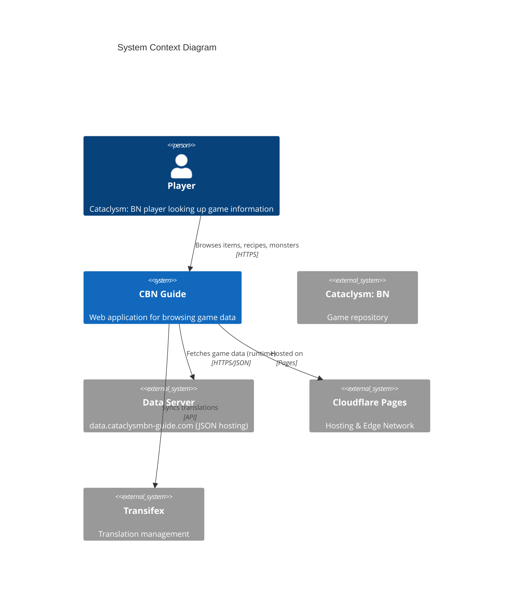
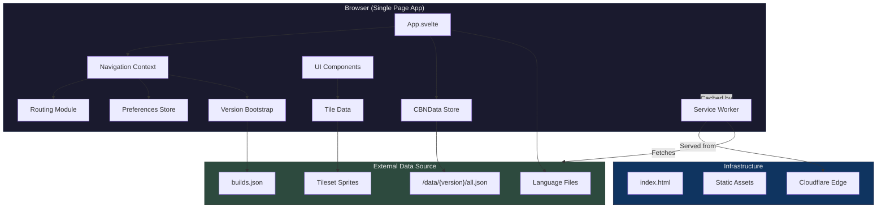
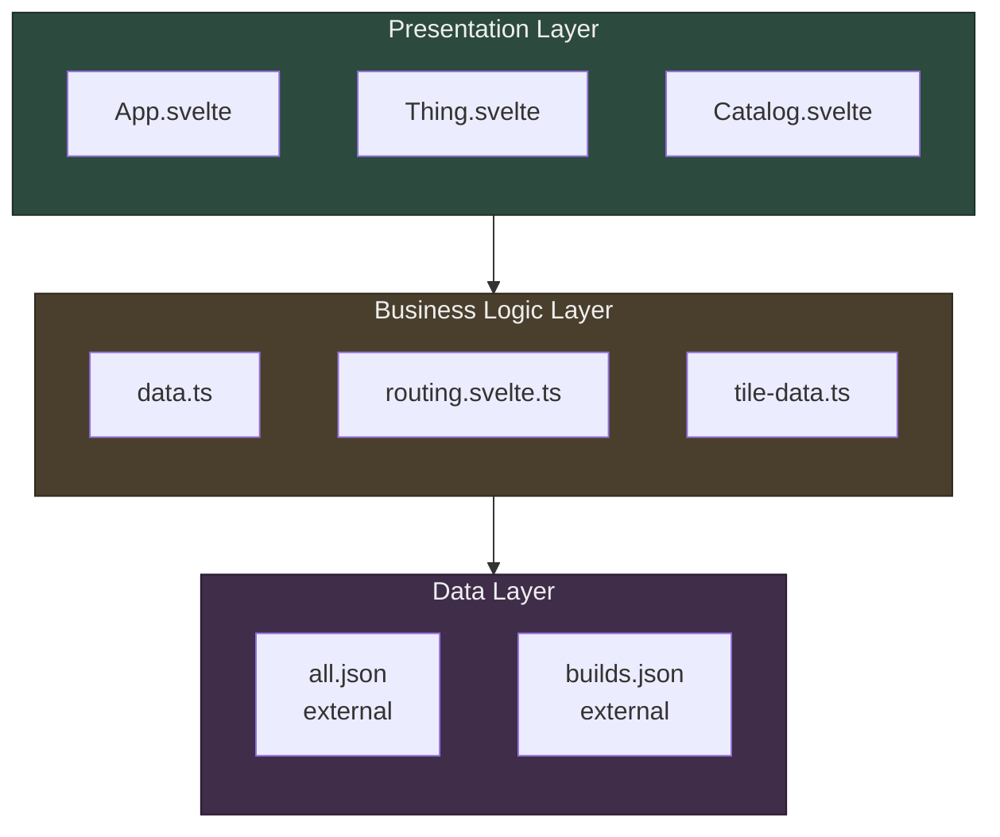
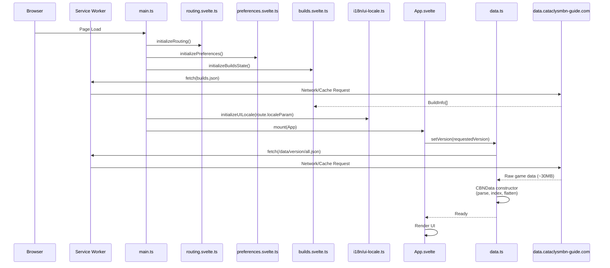
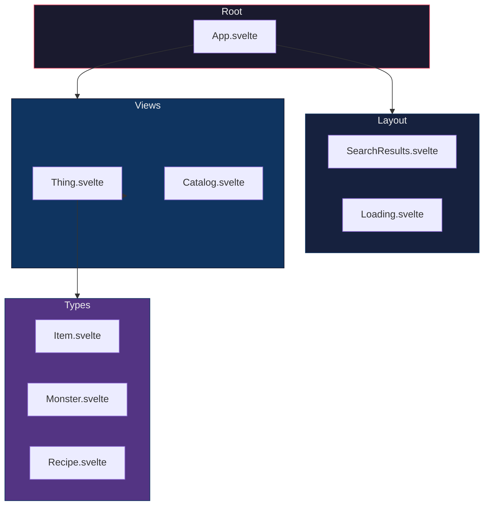
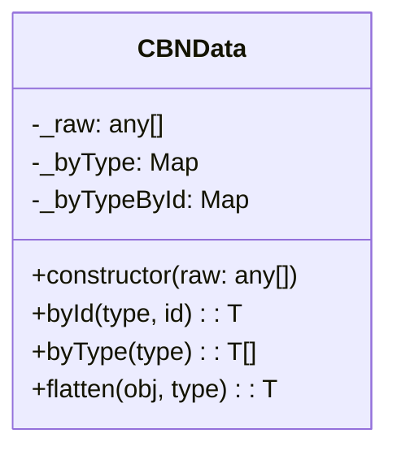
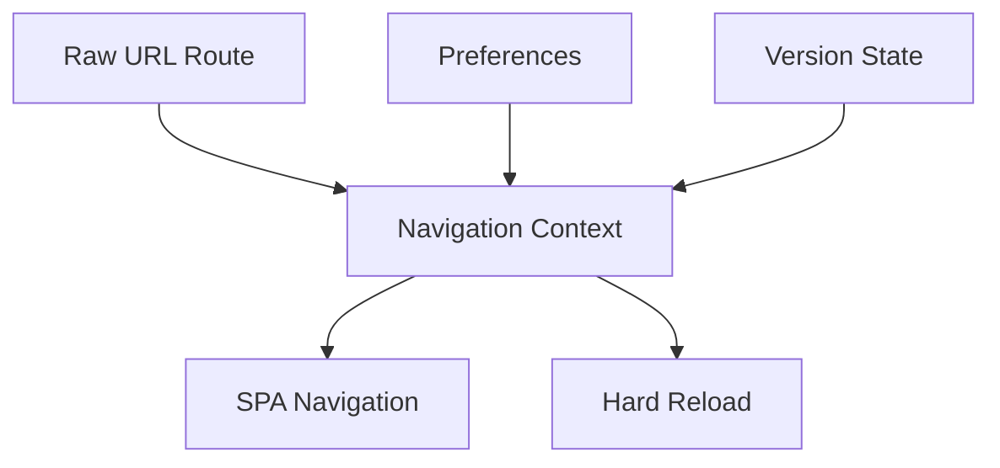
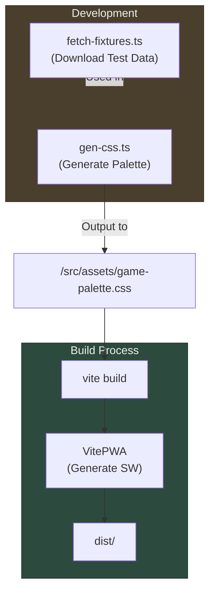

# Architecture Overview

This document provides a high-level architectural overview of the cbn-guide application — "The Hitchhiker's Guide to Cataclysm: Bright Nights."

## System Context


```mermaid
C4Context
    title System Context Diagram

    Person(user, "Player", "Cataclysm: BN player looking up game information")

    System(guide, "CBN Guide", "Web application for browsing game data")

    System_Ext(bn_repo, "Cataclysm: BN", "Game repository")
    System_Ext(data_server, "Data Server", "data.cataclysmbn-guide.com (JSON hosting)")
    System_Ext(cloudflare, "Cloudflare Pages", "Hosting & Edge Network")
    System_Ext(i18n, "Transifex", "Translation management")

    Rel(user, guide, "Browses items, recipes, monsters", "HTTPS")
    Rel(guide, data_server, "Fetches game data (runtime)", "HTTPS/JSON")
    Rel(guide, cloudflare, "Hosted on", "Pages")
    Rel(guide, i18n, "Syncs translations", "API")
```

## High-Level Architecture


```mermaid
flowchart TB
    subgraph Client["Browser (Single Page App)"]
        direction TB
        App[App.svelte]
        Router[Routing Module]
        Navigation[Navigation Context]
        Preferences[Preferences Store]
        Versioning[Version Bootstrap]
        DataStore[CBNData Store]
        Components[UI Components]
        TileData[Tile Data]
        ServiceWorker[Service Worker]
    end

    subgraph Infrastructure["Infrastructure"]
        HTML[index.html]
        Assets[Static Assets]
        Edge[Cloudflare Edge]
    end

    subgraph External["External Data Source"]
        GameData["/data/{version}/all.json"]
        Builds[builds.json]
        Tiles[Tileset Sprites]
        Langs[Language Files]
    end

    App --> Navigation
    Navigation --> Router
    Navigation --> Preferences
    Navigation --> Versioning
    App --> DataStore

    Versioning --> Builds
    DataStore --> GameData
    Components --> TileData
    TileData --> Tiles
    App --> Langs

    Client -- "Cached by" --> ServiceWorker
    ServiceWorker -- "Served from" --> Edge
    ServiceWorker -- "Fetches" --> External

    style Client fill:#1a1a2e,stroke:#16213e,color:#eee
    style Infrastructure fill:#0f3460,stroke:#16213e,color:#eee
    style External fill:#2d4a3e,stroke:#1a2f26,color:#eee
```

## Infrastructure & Deployment

The application is a purely static site (SPA) hosted on **Cloudflare Pages**.

- **Hosting**: Cloudflare Pages
- **Routing**: Client-side routing (SPA). Server-side routing rules configured via generic `_redirects` and `_headers`.
- **Configuration**:
  - `public/_headers`: Controls caching policies and preload headers.
  - `public/_redirects`: Manages version aliases (e.g., `/latest -> /nightly`) and legacy path redirections.
  - **Note**: No `wrangler.toml` is present; configuration is file-based or managed via Cloudflare Dashboard.
- **CI/CD**:
  - **GitHub Actions**: Runs tests (`pnpm test`), linting, and builds `dist` artifact for verification.
  - **Cloudflare Integration**: Automatically deploys the `dist` folder on push to `main` (via Cloudflare's git integration).

## Data & Caching Strategy

The application separates **Application Logic** (this repo) from **Game Data** (external).

### Source of Truth

All game data is hosted on `data.cataclysmbn-guide.com`. The app acts as a viewer for this external data.

### Runtime Caching (PWA)

We use `vite-plugin-pwa` (Workbox) to provide offline capability and efficient caching:

| Resource Type      | Pattern                   | Strategy                 | Rationale                                       |
| :----------------- | :------------------------ | :----------------------- | :---------------------------------------------- |
| **App Shell**      | `index.html`, `js`, `css` | **StaleWhileRevalidate** | Immediate load, update in background.           |
| **Build Index**    | `builds.json`             | **StaleWhileRevalidate** | Frequent updates, but stale is acceptable.      |
| **Nightly Data**   | `/data/nightly/*`         | **NetworkFirst**         | Nightly builds change daily; prefer fresh data. |
| **Stable Data**    | `/data/stable/*`          | **StaleWhileRevalidate** | Rarely changes.                                 |
| **Versioned Data** | `/data/v*`, `/data/20*`   | **CacheFirst**           | Immutable specific versions.                    |
| **Assets**         | Images, Fonts             | **CacheFirst**           | Long-term caching.                              |

### Data Generation (Development)

For local development and testing, scripts are used to fetch data snapshots:

- `fetch-fixtures.ts`: Downloads `all.json` to `_test/` for unit tests and local dev.
- `gen-sitemap.ts`: Fetches list of all items and generates `public/sitemap.xml`.
- `gen-css.ts`: Generates `/src/assets/game-palette.css` from `src/colors.ts` (Application defined colors).

## Internationalization Boundary

The application uses two translation layers with different runtime constraints:

- `src/i18n/gettext.ts`: Shared, Node-safe runtime translation for game data loaded from external JSON. This module is used by the app, tests, and Node scripts that import `src/data.ts`.
- `src/i18n/transifex-static.ts`: Browser-facing helpers for static UI labels that must remain literal `t("...")` calls for Transifex extraction. These helpers are intentionally isolated from shared Node-safe modules.

## Application Layers


```mermaid
flowchart TD
    subgraph Presentation["Presentation Layer"]
        direction TB
        AppSvelte[App.svelte]
        Thing[Thing.svelte]
        Catalog[Catalog.svelte]
    end

    subgraph Business["Business Logic Layer"]
        direction TB
        DataTS[data.ts]
        RoutingTS[routing.svelte.ts]
        TileDataTS[tile-data.ts]
    end

    subgraph Data["Data Layer"]
        direction TB
        AllJSON[all.json<br/>external]
        BuildsJSON[builds.json<br/>external]
    end

    Presentation --> Business
    Business --> Data

    style Presentation fill:#2d4a3e,stroke:#1a2f26,color:#eee
    style Business fill:#4a3f2d,stroke:#2f2a1a,color:#eee
    style Data fill:#3f2d4a,stroke:#2a1a2f,color:#eee
```

## Core Data Flow


```mermaid
sequenceDiagram
    participant Browser
    participant SW as Service Worker
    participant Main as main.ts
    participant Route as routing.svelte.ts
    participant Prefs as preferences.svelte.ts
    participant Builds as builds.svelte.ts
    participant I18n as i18n/ui-locale.ts
    participant App as App.svelte
    participant Data as data.ts
    participant Ext as data.cataclysmbn-guide.com

    Browser->>Main: Page Load
    Main->>Route: initializeRouting()
    Main->>Prefs: initializePreferences()
    Main->>Builds: initializeBuildsState()
    Builds->>SW: fetch(builds.json)
    SW->>Ext: Network/Cache Request
    Ext-->>Builds: BuildInfo[]
    Main->>I18n: initializeUILocale(route.localeParam)
    Main->>App: mount(App)

    App->>Data: setVersion(requestedVersion)
    Data->>SW: fetch(/data/version/all.json)
    SW->>Ext: Network/Cache Request
    Ext-->>Data: Raw game data (~30MB)

    Data->>Data: CBNData constructor<br/>(parse, index, flatten)
    Data-->>App: Ready

    App->>App: Render UI
```

## Component Architecture


```mermaid
flowchart TB
    subgraph Root["Root"]
        App[App.svelte]
    end

    subgraph Layout["Layout"]
        Search[SearchResults.svelte]
        Loading[Loading.svelte]
    end

    subgraph Views["Views"]
        Thing[Thing.svelte]
        Catalog[Catalog.svelte]
    end

    subgraph Types["Types"]
        Item[Item.svelte]
        Monster[Monster.svelte]
        Recipe[Recipe.svelte]
    end

    App --> Layout
    App --> Views
    Views --> Thing
    Thing --> Types

    style Root fill:#1a1a2e,stroke:#e94560,color:#eee
    style Layout fill:#16213e,stroke:#0f3460,color:#eee
    style Views fill:#0f3460,stroke:#1a1a2e,color:#eee
    style Types fill:#533483,stroke:#0f3460,color:#eee
```

## CBNData Class Structure


```mermaid
classDiagram
    class CBNData {
        -_raw: any[]
        -_byType: Map
        -_byTypeById: Map
        +constructor(raw: any[])
        +byId(type, id): T
        +byType(type): T[]
        +flatten(obj, type): T
    }
```

## Routing System

The routing system is now layered: raw URL state lives in `routing.svelte.ts`,
preferences live in `preferences.svelte.ts`, version bootstrap lives in
`builds.svelte.ts`, and effective in-app link context lives in `navigation.svelte.ts`.


```mermaid
flowchart TB
    URL["Raw URL Route"]
    Prefs["Preferences"]
    Version["Version State"]
    Nav["Navigation Context"]
    Soft["SPA Navigation"]
    Hard["Hard Reload"]

    URL --> Nav
    Prefs --> Nav
    Version --> Nav
    Nav --> Soft
    Nav --> Hard
```

## Development & Build Pipeline


```mermaid
flowchart TD
    subgraph Dev["Development"]
        Fetch["fetch-fixtures.ts<br/>(Download Test Data)"]
        GenCSS["gen-css.ts<br/>(Generate Palette)"]
    end

    subgraph Build["Build Process"]
        Vite["vite build"]
        SWGen["VitePWA<br/>(Generate SW)"]
        Output["dist/"]
    end

    Fetch -->|Used in| Dev
    GenCSS -->|Output to| Public["/src/assets/game-palette.css"]
    Public --> Vite
    Vite --> SWGen
    SWGen --> Output

    style Dev fill:#4a3f2d,stroke:#2f2a1a,color:#eee
    style Build fill:#2d4a3e,stroke:#1a2f26,color:#eee
```

## Technology Stack

- **Frontend**: Svelte 5, TypeScript, Vite
- **PWA**: vite-plugin-pwa, Workbox (Offline support)
- **Styling**: Scoped CSS, CSS Variables
- **Data**: External JSON (fetched runtime), copy-from inheritance, Transifex i18n
- **Infrastructure**: Cloudflare Pages
- **Testing**: Vitest, Puppeteer, svelte-check

## File Structure Overview

```
cbn-guide/
├── src/
│   ├── App.svelte          # Main application component
│   ├── data.ts             # CBNData class & utilities
│   ├── i18n/               # Translation helpers split by runtime boundary
│   ├── navigation.svelte.ts       # Effective navigation context and app link policy
│   ├── preferences.svelte.ts      # Browser-persisted user preferences
│   ├── routing.svelte.ts          # URL routing logic
│   ├── tile-data.ts        # Tileset sprite management
│   ├── builds.svelte.ts           # builds.json fetch + version alias resolution
│   ├── assets/             # Static assets
│   └── ...
├── public/
│   ├── _headers            # Cloudflare headers config
│   ├── _redirects          # Cloudflare redirects
│   └── sitemap.xml         # Generated sitemap
├── scripts/
│   ├── fetch-fixtures.ts   # Fetch data for local dev/test
│   ├── gen-css.ts          # Generate CSS palette
│   └── gen-sitemap.ts      # Generate sitemap
├── docs/
│   ├── adr/                # Architecture Decision Records
│   └── architecture.md     # This file
└── _test/                  # Test fixtures (all.json)
```

## Related Documentation

- [Routing Architecture](./routing.md)
- [Reactivity Guide](./reactivity.md)
- [Development Guide](../DEVELOPMENT.md)
- [Architecture Decision Records](./adr/)
- [AGENTS.md](../AGENTS.md)
