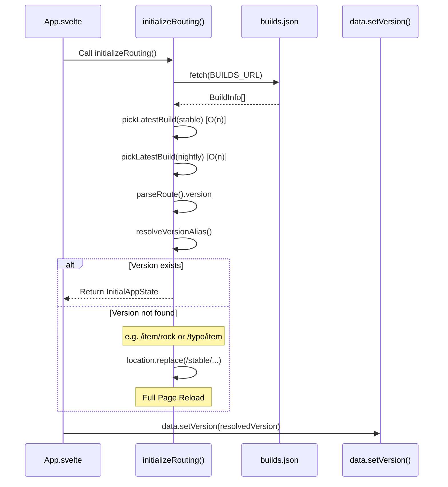
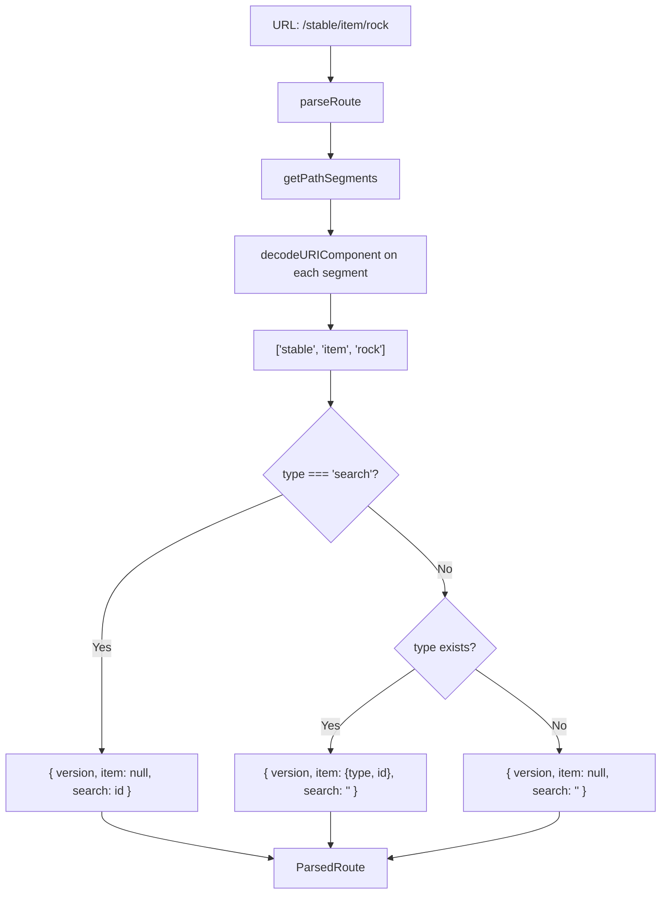

# Routing Architecture

This document describes the routing and navigation architecture of the cbn-guide application.

## Overview

The application uses a **hybrid routing approach**:

- **Full page reloads** for version, language, and tileset changes
- **Full page reloads** for version, language, and tileset changes
- **SPA (Single Page Application) navigation** for browsing items, searching, and catalog navigation
- **Smart path correction** for legacy or incomplete URLs (e.g., `/item/rock` → `/stable/item/rock`)

### Key Principles

- **URL as single source of truth**: No separate state store for routing
- **Functional design**: Pure functions for URL parsing and construction
- **Type safe**: Full TypeScript coverage with exported types

## URL Structure

```
/{version}/{type?}/{id?}?lang={locale}&t={tileset}
```

### Path Segments

1. **`{version}`** (required): Version identifier
   - Can be an alias: `"stable"`, `"nightly"`, or `"latest"`
   - Or a specific build number: `"2025-12-30"`, `"v1.0.0"`, etc.
   - Default: `"stable"`

2. **`{type}`** (optional): Object type
   - Examples: `"item"`, `"recipe"`, `"monster"`, etc.
   - When present without `{id}`, shows catalog view for that type
   - When omitted, shows home page
   - Special case: `"search"` indicates search mode

3. **`{id}`** (optional): Object identifier
   - Examples: `"rock"`, `"genome_sampler"`, etc.
   - Requires `{type}` to be present
   - When `{type}` is `"search"`, this is the search query
   - **Encoding**: Uses standard `encodeURIComponent` (spaces as `%20`, `+` as `%2B`)

### Query Parameters

- **`lang`**: Language code (e.g., `"en"`, `"ru_RU"`, `"zh_CN"`)
  - Default: `"en"` (English)
  - Omitted from URL when set to English
  - **Triggers full page reload** when changed

- **`t`**: Tileset identifier (e.g., `"BrownLikeBears"`, `"UltimateCataclysm"`)
  - Default: `"-"` (ASCII mode)
  - Stored in localStorage as `"cbn-guide:tileset"`
  - **Triggers full page reload** when changed
  - Resolution Priority:
    1. URL Parameter (`?t=`)
    2. `localStorage`
    3. Default (ASCII)

## Navigation Types

### 1. Full Page Reload (Hard Navigation)

**When it happens:**

- User changes version in the version selector
- User changes language in the language selector
- User changes tileset in the tileset selector

**Rationale:**

- **Version changes**: Require loading completely different data files (`all.json` is ~30MB+)
- **Language changes**: Require reloading all translated content (e.g., requesting `lang/ru.json`)
- **Tileset changes**: Require reloading tileset asset URLs

**Side effects:**

- Component is destroyed and recreated
- All initialization logic runs again:
  - `initializeRouting()` executes
  - `data.setVersion()` is called
  - Page re-renders from scratch

### 2. SPA Navigation (Soft Navigation)

**When it happens:**

- User clicks internal links to items, recipes, monsters, etc.
- User performs searches
- User uses browser back/forward buttons
- User navigates catalogs

**Rationale:**

- Fast navigation without reloading data
- Preserves loaded game data in memory
- Better user experience

## Initialization Flow



## URL Parsing and Routing



## State Management

### Component State (`src/App.svelte`)

| Variable             | Purpose                       | Scope     | Source                |
| -------------------- | ----------------------------- | --------- | --------------------- |
| `resolvedVersion`    | Current resolved build number | Component | `initializeRouting()` |
| `requestedVersion`   | Version slug from URL         | Component | `parseRoute()`        |
| `builds`             | List of available builds      | Component | `initializeRouting()` |
| `latestStableBuild`  | Latest stable build info      | Component | `initializeRouting()` |
| `latestNightlyBuild` | Latest nightly build info     | Component | `initializeRouting()` |
| `item`               | Currently displayed item      | Component | `parseRoute()`        |
| `search`             | Current search query          | Component | `parseRoute()`        |
| `tileset`            | Current tileset ID            | Component | `getUrlConfig()`      |
| `locale`             | Current language code         | Component | `getUrlConfig()`      |

### Svelte Stores (`src/data.ts`)

| Store  | Type                        | Purpose              |
| ------ | --------------------------- | -------------------- |
| `data` | `Writable<CBNData \| null>` | Main game data store |

### localStorage

| Key                   | Value             | Purpose                           |
| --------------------- | ----------------- | --------------------------------- |
| `"cbn-guide:tileset"` | Tileset ID string | Remember user's preferred tileset |

## Version Resolution

The version resolution follows this priority:

1. **Parse URL** to get requested version slug
2. **Resolve alias** (if applicable):
   - `"stable"` → Latest stable build number
   - `"nightly"` or `"latest"` → Latest nightly build number
   - Other values → Pass through as-is
3. **Validate** resolved version exists in builds list
4. **Correction (Prepend `/stable/`)**:
   - If the version looks valid (e.g. `v0.9`), stay (let it error out later or handle as offline)
   - If the segment is NOT a known version, assumes it is a legacy path or data type
   - **ACTION**: Prepend `/stable/` to the current path and force a full page reload
   - Example: `/item/rock` → `/stable/item/rock`
5. **Fallback** (only if everything fails):
   - Use latest stable build, OR
   - Use latest nightly build, OR
   - Use first available build, OR
   - "Grinch-v1.0"

## API Reference

### Exported Functions

#### Read Operations

##### `parseRoute(): ParsedRoute`

Parses the current URL and extracts route information.

**Returns:**

```typescript
{
  version: string;        // Version slug from URL
  item: {                 // null if search or home
    type: string;
    id: string;
  } | null;
  search: string;         // Empty string if not search
}
```

**Example:**

```typescript
// URL: /stable/item/rock
parseRoute(); // { version: "stable", item: { type: "item", id: "rock" }, search: "" }

// URL: /nightly/search/C%2B%2B
parseRoute(); // { version: "nightly", item: null, search: "C++" }
```

##### `getUrlConfig(): UrlConfig`

Extracts configuration from URL query parameters.

**Returns:**

```typescript
{
  locale: string | null; // ?lang= parameter
  tileset: string | null; // ?t= parameter
}
```

##### `getCurrentVersionSlug(): string`

Gets the current version slug from URL (for building relative URLs).

**Returns:** Version string from first path segment, or `"stable"` as default

**Example:**

```typescript
// URL: /nightly/item/rock
getCurrentVersionSlug(); // "nightly"

// URL: /
getCurrentVersionSlug(); // "stable"
```

##### `getVersionedBasePath(): string`

Gets the base path for the current version.

**Returns:** Base path string (e.g., `"/cbn-guide/stable/"`)

**Usage:** Building href strings in templates

```svelte
<a href="{getVersionedBasePath()}item/rock">Rock</a>
```

##### `isSupportedVersion(buildNumber: string): boolean`

Checks if a build number is v0.7.0 or later.

**Example:**

```typescript
isSupportedVersion("v0.7.0"); // true
isSupportedVersion("v0.6.5"); // false
isSupportedVersion("2025-12-30"); // true (assumes recent = supported)
```

#### Build Operations

##### `buildUrl(version, item, search, locale?, tileset?): string`

Builds a complete URL from route components.

**Parameters:**

- `version: string` - Version slug or build number
- `item: { type: string; id: string } | null` - Item to navigate to
- `search: string` - Search query
- `locale?: string | null` - Language code (omit for English)
- `tileset?: string | null` - Tileset ID

**Returns:** Complete URL string

**Example:**

```typescript
buildUrl("stable", { type: "item", id: "rock" }, "");
// "http://localhost:3000/cbn-guide/stable/item/rock"

buildUrl("nightly", null, "C++", "ru_RU", "UltimateCataclysm");
// "http://localhost:3000/cbn-guide/nightly/search/C%2B%2B?lang=ru_RU&t=UltimateCataclysm"
```

#### Navigation Operations

##### `updateSearchRoute(searchQuery, currentItem): void`

Updates the URL to reflect a search query.

**Behavior:**

- Uses `pushState` when navigating from an item
- Uses debounced `replaceState` (400ms trailing) when typing in search box
- Cancellation-aware: explicit navigation cancels pending updates

##### `changeVersion(newVersion: string): void`

Changes version and triggers full page reload.

**Side effect:** `location.href` assignment → full page reload

##### `updateQueryParam(param: string, value: string | null): void`

Updates a query parameter and triggers full page reload.

**Rationale:** Changing `lang` or `t` requires reloading data/assets

**Side effect:** `location.href` assignment → full page reload

##### `handleInternalNavigation(event: MouseEvent): boolean`

Handles click events to intercept internal navigation.

**Returns:** `true` if navigation was handled, `false` otherwise

#### Initialization

##### `initializeRouting(): Promise<InitialAppState>`

Initializes routing by fetching builds and resolving the requested version.

**Returns:**

```typescript
{
  builds: BuildInfo[];
  resolvedVersion: string;
  latestStableBuild?: BuildInfo;
  latestNightlyBuild?: BuildInfo;
}
```

**Process:**

1. Fetches `builds.json`
2. Finds latest stable and nightly builds (O(n) linear scan)
3. Resolves version alias from URL
4. Validates version exists
5. Redirects to fallback if needed

**Throws:** Error if builds.json fails to load

### Types

```typescript
export type BuildInfo = {
  build_number: string;
  prerelease: boolean;
  created_at: string;
  langs?: string[];
};

export type ParsedRoute = {
  version: string;
  item: { type: string; id: string } | null;
  search: string;
};

export type UrlConfig = {
  locale: string | null;
  tileset: string | null;
};

export type InitialAppState = {
  builds: BuildInfo[];
  resolvedVersion: string;
  latestStableBuild?: BuildInfo;
  latestNightlyBuild?: BuildInfo;
};
```

## Common Patterns

### Adding a New Query Parameter

1. Extract parameter in component initialization:

   ```typescript
   const myParam = getUrlConfig().myParam; // Add to UrlConfig type
   ```

2. Update `getUrlConfig()` to include it:

   ```typescript
   export function getUrlConfig(): UrlConfig {
     return {
       locale: getSearchParam("lang"),
       tileset: getSearchParam("t"),
       myParam: getSearchParam("my_param"),
     };
   }
   ```

3. Add select handler using `updateQueryParam()`:

   ```typescript
   on:change={(e) => {
     updateQueryParam("my_param", e.currentTarget.value);
   }}
   ```

### Adding SPA Navigation to a New Page Type

1. Update `parseRoute()` to handle the new path pattern (if needed)

2. Ensure links use the standard format:

   ```svelte
   <a href="{getVersionedBasePath()}my_new_type/{id}">
   ```

3. The existing `handleInternalNavigation()` will automatically intercept these links

### Building Dynamic Links

Use helper functions for building URLs:

```svelte
<a href="{getVersionedBasePath()}item/{item.id}">
```

Or build complete URLs with query params:

```svelte
<script>
  import { buildUrl, getCurrentVersionSlug } from "./routing";

  $: itemUrl = buildUrl(getCurrentVersionSlug(), { type: "item", id: item.id }, "");
</script>

<a href="{itemUrl}">
```

## Debugging Tips

### Check URL Parsing

```typescript
import { parseRoute } from "./routing";

// In browser console
parseRoute();
// { version: "stable", item: { type: "item", id: "rock" }, search: "" }
```

### Verify Version Resolution

```typescript
import { getCurrentVersionSlug } from "./routing";

getCurrentVersionSlug(); // "stable", "nightly", or build number
```

### Inspect State

```typescript
// Check current path segments (internal function, but accessible via parseRoute)
const route = parseRoute();
console.log("Version:", route.version);
console.log("Item:", route.item);
console.log("Search:", route.search);

// Check if version exists in builds
builds?.find((b) => b.build_number === resolvedVersion);
```

### Watch for Fallbacks

Check console for warnings:

```
Version XYZ not found in builds list, falling back to 2025-12-30.
```

### Test URL Encoding

```typescript
import { buildUrl } from "./routing";

// Test special characters
buildUrl("stable", null, "C++ test", null, null);
// Should encode to: /stable/search/C%2B%2B%20test

// Verify round-trip
const url = buildUrl("stable", null, "C++", null, null);
// Navigate to URL, then:
parseRoute().search; // Should be "C++" (correctly decoded)
```

## Known Limitations

1. **Search in URL**: Search queries are in the path (`/search/{query}`) rather than query params for cleaner URLs. Special characters are properly encoded with `encodeURIComponent`.

## Related Documentation

- [Reactivity Guide](./reactivity.md) — Route-driven remounting and where `$:` matters

2. **Error handling**: When builds.json fails to load, app shows error in console with TODO to notify user visually.

3. **Version fallback**: Uses hardcoded `"Grinch-v1.0"` as ultimate fallback. This is an unlikely edge case (totally offline with no builds).

## Future Improvements

- [ ] Visual error notification when builds.json fails to load
- [ ] User notification when falling back to different version
- [ ] Add loading states during version transitions
