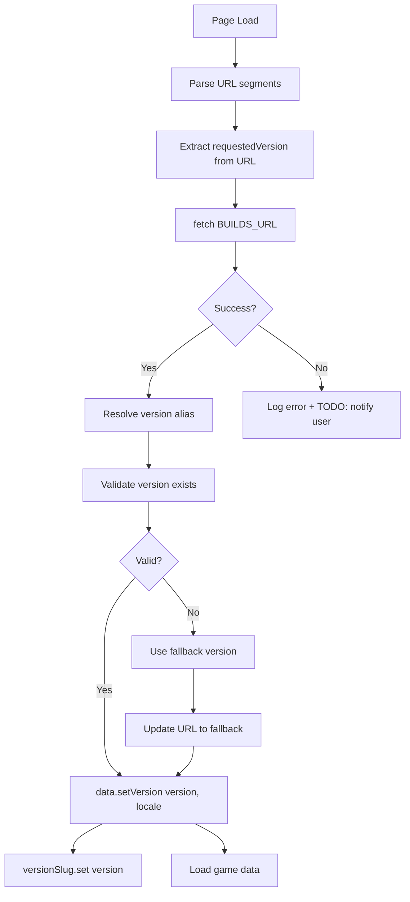

# Routing Architecture

This document describes the routing and navigation architecture of the cbn-guide application.

## Overview

The application uses a **hybrid routing approach**:

- **Full page reloads** for version, language, and tileset changes
- **SPA (Single Page Application) navigation** for browsing items, searching, and catalog navigation

## URL Structure

```
/{version}/{type?}/{id?}?lang={locale}&t={tileset}
```

### Path Segments

1. **`{version}`** (required): Version identifier
   - Can be an alias: `"stable"`, `"nightly"`, or `"latest"`
   - Or a specific build number: `"2025-12-30"`, `"v1.0.0"`, etc.
   - Default: `"stable"`

2. **`{type}`** (optional): Object type
   - Examples: `"item"`, `"recipe"`, `"monster"`, etc.
   - When present without `{id}`, shows catalog view for that type
   - When omitted, shows home page

3. **`{id}`** (optional): Object identifier
   - Examples: `"rock"`, `"genome_sampler"`, etc.
   - Requires `{type}` to be present
   - Special case: When `{type}` is `"search"`, this is the search query

### Query Parameters

- **`lang`**: Language code (e.g., `"en"`, `"ru_RU"`, `"zh_CN"`)
  - Default: `"en"` (English)
  - Omitted from URL when set to English

- **`t`**: Tileset identifier (e.g., `"BrownLikeBears"`, `"UltimateCataclysm"`)
  - Default: `"-"` (ASCII mode)
  - Stored in localStorage as `"cbn-guide:tileset"`
  - Resolution Priority:
    1. URL Parameter (`?t=`)
    2. `localStorage`
    3. Default (ASCII)

## Navigation Types

### 1. Full Page Reload (Hard Navigation)

**When it happens:**

- User changes version in the version selector
- User changes language in the language selector
- User changes tileset in the tileset selector

**How it works:**

```typescript
// All three selectors use location.href assignment
location.href = newUrl;
```

**Rationale:**

- **Version changes**: Require loading completely different data files (`all.json` is ~50MB+)
- **Language changes**: Require reloading all translated content (e.g., requesting `lang/ru.json`)
- **Tileset changes**: Require reloading tileset asset URLs

**Side effects:**

- Component is destroyed and recreated
- All initialization logic runs again:
  - `fetch(BUILDS_URL)` executes
  - `data.setVersion()` is called (enforced once-per-session by `_hasSetVersion` guard)
  - `load()` function executes

### 2. SPA Navigation (Soft Navigation)

**When it happens:**

- User clicks internal links to items, recipes, monsters, etc.
- User performs searches
- User uses browser back/forward buttons
- User navigates catalogs

**How it works:**

```typescript
// Link clicks are intercepted by maybeNavigate()
history.pushState(null, "", newPath);
load(); // Parse URL and update component state

// Browser back/forward
window.addEventListener("popstate", () => {
  load();
});
```

**Rationale:**

- Fast navigation without reloading data
- Preserves loaded game data in memory
- Better user experience

## State Management

### Component State (`src/App.svelte`)

| Variable             | Purpose                       | Scope     |
| -------------------- | ----------------------------- | --------- |
| `version`            | Current resolved build number | Component |
| `requestedVersion`   | Version slug from URL         | Component |
| `builds`             | List of available builds      | Component |
| `latestStableBuild`  | Latest stable build info      | Component |
| `latestNightlyBuild` | Latest nightly build info     | Component |
| `item`               | Currently displayed item      | Component |
| `search`             | Current search query          | Component |
| `tileset`            | Current tileset ID            | Component |
| `locale`             | Current language code         | Component |

### Svelte Stores (`src/data.ts`)

| Store         | Type                         | Purpose                            |
| ------------- | ---------------------------- | ---------------------------------- |
| `data`        | `Writable<CddaData \| null>` | Main game data store               |
| `versionSlug` | `Writable<string>`           | Current version for URL generation |

**Important:** `versionSlug` is set **only** in `data.setVersion()` to ensure it stays in sync with loaded data.

### localStorage

| Key                   | Value             | Purpose                           |
| --------------------- | ----------------- | --------------------------------- |
| `"cbn-guide:tileset"` | Tileset ID string | Remember user's preferred tileset |

**Note:** Version caching was removed for simplicity. Users can bookmark specific versions if needed.

## Data Loading Flow

### Initial Page Load



### Version Resolution

The version resolution follows this priority:

1. **Resolve alias** (if URL contains `"stable"`, `"nightly"`, or `"latest"`):
   - `"stable"` → Latest stable build number
   - `"nightly"` or `"latest"` → Latest nightly build number
   - Other values → Pass through as-is

2. **Validate** resolved version exists in builds list

3. **Fallback** if version not found:
   - Use latest stable build, OR
   - Use latest nightly build, OR
   - Use first available build, OR
   - Use `"Grinch-v1.0"` (hardcoded fallback)

4. **Update URL** if fallback was used (with actual build number, not alias)

## Function Reference

### `src/App.svelte`

#### `getPathSegments(): string[]`

Extracts and decodes path segments relative to `BASE_URL`.

**Returns:** Array of path segments (e.g., `["2025-12-30", "item", "rock"]`)

#### `getCurrentVersionSlug(): string`

Gets the current version slug from the URL.

**Returns:** Version string from first path segment, or `"stable"` as default

#### `load(): void`

Parses the current URL and updates component state (`item`, `search`). Called on initial load and for SPA navigation.

**Side effects:**

- Updates `item` or `search` based on URL
- Scrolls window to top

#### `resolveAlias(slug: string): string | undefined`

Converts version alias to actual build number.

**Parameters:**

- `slug`: Version alias or build number

**Returns:**

- Actual build number if alias matches
- Original slug if not an alias
- `undefined` if can't resolve

#### `maybeNavigate(event: MouseEvent): void`

Intercepts clicks on internal links to enable SPA navigation.

**Behavior:**

- Checks if clicked element is an anchor with same origin
- Prevents default navigation
- Uses `history.pushState()` for SPA navigation
- Calls `load()` to update state

### `src/data.ts`

#### `data.setVersion(version: string, locale: string | null): Promise<void>`

Loads game data for specified version and language.

**Side effects:**

- Sets `versionSlug` store to the version
- Fetches and parses game data JSON
- Fetches and sets up i18n if locale specified
- Updates `data` store with loaded `CddaData` instance

**Note:** This is the **only** place where `versionSlug` should be set.

## Common Patterns

### Adding a New Query Parameter

1. Extract parameter in component initialization:

   ```typescript
   const myParam = url.searchParams.get("my_param");
   ```

2. Update `getCleanUrl()` to include it:

   ```typescript
   if (myParam) {
     u.searchParams.set("my_param", myParam);
   }
   ```

3. Add select handler that uses `location.href` if it requires reload:
   ```typescript
   on:change={(e) => {
     const url = new URL(location.href);
     url.searchParams.set("my_param", e.currentTarget.value);
     location.href = url.toString();
   }}
   ```

### Adding SPA Navigation to a New Page Type

1. Update `load()` function to handle the new path pattern:

   ```typescript
   if (type === "my_new_type") {
     // Set component state appropriately
   }
   ```

2. Ensure links use the standard format:

   ```svelte
   <a href="{import.meta.env.BASE_URL}{version}/my_new_type/{id}">
   ```

3. The existing `maybeNavigate()` handler will automatically intercept these links

## Debugging Tips

### Check Version Resolution

Open browser console and look for:

```
Set version to v=2025-12-30, lang=en
```

### Verify URL Structure

Check `location.pathname` matches expected format:

```typescript
console.log(location.pathname);
// Expected: "/cbn-guide/2025-12-30/item/rock"
```

### Inspect State

In browser console:

```typescript
// Check current path segments
getPathSegments();

// Check if version exists in builds
builds?.find((b) => b.build_number === version);
```

### Watch for Fallbacks

Check console for warnings:

```
Version XYZ not found in builds list, falling back to 2025-12-30.
```

## Known Limitations

1. **No version caching**: Removed for simplicity. Users default to "stable" unless they bookmark a specific version.

2. **Search in URL**: Search queries are in the path (`/search/{query}`) rather than query params for cleaner URLs, but this means special characters need encoding.

3. **Error handling**: When builds.json fails to load, app shows error in console with TODO to notify user visually.

## Future Improvements

- [ ] Visual error notification when builds.json fails to load
- [ ] User notification when falling back to different version
- [ ] Consider moving search to query param (`?q=`) for better special character handling
- [ ] Add loading states during version transitions
