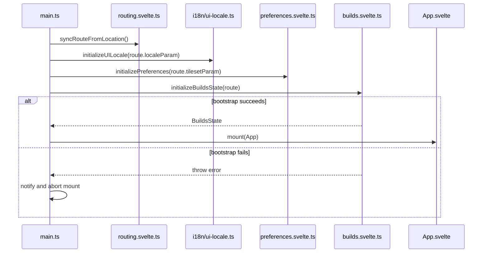

# Routing Architecture

This document describes the current routing and bootstrap architecture of the
cbn-guide application after the first refactor pass.

## Overview

The app now distinguishes between four different kinds of truth:

- Raw URL state in [`src/routing.svelte.ts`](../src/routing.svelte.ts)
- Persisted browser preferences in [`src/preferences.svelte.ts`](../src/preferences.svelte.ts)
- Version/bootstrap state in [`src/builds.svelte.ts`](../src/builds.svelte.ts)
- Effective in-app navigation context in [`src/navigation.svelte.ts`](../src/navigation.svelte.ts)

That separation matters because tileset is not purely a URL concern anymore. The
UI can render with a preferred tileset even when `?t=` is absent, and normal
in-app links should preserve that effective context instead of consulting only
the raw address bar.

## URL Shape

```text
/{versionSlug}/{type?}/{id?}?lang={locale}&t={tileset}&mods={mods}
```

- `versionSlug`: `stable`, `nightly`, `latest`, or a concrete build number
- `type`: content type or `search`
- `id`: object identifier or search query
- `lang`: route-owned locale override, omitted for English
- `t`: optional tileset override
- `mods`: comma-separated mod ids, normalized into an ordered `string[]`

## Ownership Model

### `src/routing.svelte.ts`

Owns:

- parsing `location` into a raw route
- serializing routes back into URLs
- `pushState`, `replaceState`, and `popstate` synchronization
- the hard-navigation policy for route-owned fields

Does not own:

- `localStorage`
- resolved version bootstrap
- effective tileset fallback
- default in-app link context

### `src/preferences.svelte.ts`

Owns:

- `localStorage["cbn-guide:tileset"]`
- tileset preference validation and fallback

### `src/builds.svelte.ts`

Owns:

- fetching `builds.json`
- sorting builds
- resolving `stable` / `nightly` / `latest`
- validating requested version slugs against fetched build metadata

Does not own:

- route intent guessing for malformed or versionless paths
- browser redirects
- notification UI

### `src/navigation.svelte.ts`

Owns:

- the effective navigation context derived from route + preferences + version
- default in-app link generation
- app-level navigation actions such as changing tileset, language, version, and
  mods

### `src/i18n/ui-locale.ts`

Owns:

- Transifex locale candidate generation
- locale fallback sequencing before app mount

### `src/main.ts`

Owns the startup order:

1. sync route from `location`
2. initialize UI locale
3. initialize preferences
4. initialize builds state
5. mount `App.svelte` on success
6. surface an explicit notification on bootstrap failure

Bootstrap no longer guesses user intent from malformed paths and no longer
encodes redirect outcomes in store state. If bootstrap fails, the app reports
the failure and stays unmounted instead of reloading or silently continuing.

## State Model

### Raw URL Route

```ts
type URLRoute = {
  versionSlug: string;
  modsParam: string[];
  localeParam: string | null;
  tilesetParam: string | null;
  target: RouteTarget;
};
```

This is a direct description of the address bar. It does not guess an effective
tileset when `tilesetParam` is absent or invalid.

### Preferences

```ts
type UserPreferences = {
  preferredTileset: string;
};
```

### Builds State

```ts
type BuildsState = {
  builds: BuildInfo[] | null;
  requestedVersion: string | null;
  resolvedVersion: string | null;
  latestStableBuild?: BuildInfo;
  latestNightlyBuild?: BuildInfo;
};
```

### Effective Navigation Context

```ts
type NavigationContext = {
  url: URL;
  route: URLRoute;
  buildVersion: string | null;
  locale: string;
  tileset: string;
};
```

Rules:

- `locale = route.localeParam ?? "en"`
- `tileset = valid(route.tilesetParam) ?? preferredTileset ?? DEFAULT_TILESET`

## Startup Sequence


```mermaid
sequenceDiagram
    participant Main as main.ts
    participant Route as routing.svelte.ts
    participant I18n as i18n/ui-locale.ts
    participant Prefs as preferences.svelte.ts
    participant Builds as builds.svelte.ts
    participant App as App.svelte

    Main->>Route: syncRouteFromLocation()
    Main->>I18n: initializeUILocale(route.localeParam)
    Main->>Prefs: initializePreferences(route.tilesetParam)
    Main->>Builds: initializeBuildsState(route)

    alt bootstrap succeeds
        Builds-->>Main: BuildsState
        Main->>App: mount(App)
    else bootstrap fails
        Builds-->>Main: throw error
        Main->>Main: notify and abort mount
    end
```

## Navigation Rules

### Soft Navigation

SPA navigation is allowed when these route-owned facts stay unchanged:

- `versionSlug`
- `localeParam`
- `modsParam`

Tileset changes do not force a hard navigation.

### Hard Navigation

Hard reloads are used for:

- version changes
- locale changes
- mod changes

### Tileset Changes

When the user changes tileset from the UI:

- preferences are updated immediately
- the current URL gets `?t=` via `replaceState`
- the page stays soft-navigated

### URL Tileset Overrides

When startup sees a valid `?t=`:

- it becomes the effective tileset
- it is persisted as the preferred tileset

This keeps copied URLs honest and keeps future navigation aligned with what the
user actually saw.

## Link Generation Policy

### Default In-App Links

Use `buildLinkTo()` from [`src/navigation.svelte.ts`](../src/navigation.svelte.ts).

Default links preserve:

- current version slug
- current locale
- current effective tileset
- current mods

### Canonical Links

Generated explicitly in `App.svelte` and intentionally omit tileset:

- stable version slug
- current route target
- current locale
- current mods

### Alternate-Language Links

Generated explicitly in `App.svelte` and intentionally omit tileset:

- current version slug
- current route target
- explicit alternate locale
- current mods

## Public APIs

### `src/routing.svelte.ts`

- `parseRoute(url): URLRoute`
- `buildURL(versionSlug, target, options): string`
- `page`
- `syncRouteFromLocation()`
- `requiresHardNavigation(current, next)`
- `handleInternalNavigation(event)`

### `src/navigation.svelte.ts`

- `navigation`
- `navigationSnapshot()`
- `buildLinkTo(target)`
- `navigateTo(target)`
- `updateSearchRoute(searchQuery, currentTarget)`
- `changeTileset(tileset)`
- `changeLanguage(locale)`
- `changeVersion(versionSlug)`
- `changeMods(mods)`

### `src/builds.svelte.ts`

- `buildsState`
- `initializeBuildsState(route)`
- `isSupportedVersion(buildNumber)`

### `src/i18n/ui-locale.ts`

- `getTransifexLocaleCandidates(locale)`
- `initializeUILocale(locale)`
