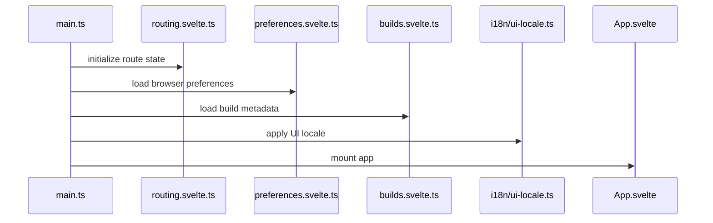

# Routing Architecture

This document describes how navigation state is organized in the application and how that state moves between the URL, browser preferences, bootstrap metadata, and the app shell.

## Overview

Routing is split across a few distinct layers:

- [`src/routing.svelte.ts`](../src/routing.svelte.ts) owns the raw address bar, history integration, and internal SPA navigation.
- [`src/preferences.svelte.ts`](../src/preferences.svelte.ts) owns browser-persisted display preferences.
- [`src/builds.svelte.ts`](../src/builds.svelte.ts) owns build metadata and version alias resolution.
- [`src/navigation.svelte.ts`](../src/navigation.svelte.ts) exposes the effective navigation context used by the UI and by normal in-app links.
- [`src/App.svelte`](../src/App.svelte) renders from that effective context and reacts to navigation changes by loading data, updating metadata, and showing user-facing warnings.

The key design point is that not every navigation fact belongs to the URL in the same way. Build version, locale, and mods determine which data is loaded. Tileset is primarily a display choice, but it can still be overridden by the URL when a link needs to be shareable and explicit.

## URL Shape

```text
/{version}/{type?}/{id?}?lang={locale}&t={tileset}&mods={mods}
```

- The path identifies the requested build and target page.
- `lang` selects the UI and game-data locale.
- `t` selects an explicit tileset override.
- `mods` selects the active mod set.

Search uses the same shape as the rest of the app: the search query lives in the path, while locale, tileset, and mods remain query-backed context.

## Ownership Model

### `src/routing.svelte.ts`

Owns:

- parsing the current URL into route state
- canonicalizing malformed version URLs once build metadata is available
- building URLs from navigation targets
- keeping browser history and route state in sync
- deciding whether an internal click can stay inside the SPA

Does not own:

- browser persistence
- build metadata
- display preference fallback
- default link policy for the rest of the app

### `src/preferences.svelte.ts`

Owns:

- persisted display preferences
- validation and fallback of persisted preference values

### `src/builds.svelte.ts`

Owns:

- fetching build metadata
- resolving version aliases such as `stable` and `nightly`
- validating that the requested build can be resolved

### `src/navigation.svelte.ts`

Owns:

- the effective navigation context used by the UI
- default link generation for normal in-app movement
- user actions that represent navigation intent, such as changing build, locale, tileset, or mods

### `src/i18n/ui-locale.ts`

Owns:

- locale fallback for UI translations before mount

### `src/main.ts`

Owns:

- startup sequencing
- bootstrap failure handling

## State Model

The navigation system works with four kinds of state:

- raw route state from the browser URL
- persisted browser preferences
- build metadata needed to resolve version aliases
- effective app navigation context used by rendering and by normal internal links

That separation matters because the app should preserve what the user is actually viewing, not just what happens to be written literally in the address bar.

## Startup Sequence


```mermaid
sequenceDiagram
    participant Main as main.ts
    participant Route as routing.svelte.ts
    participant Prefs as preferences.svelte.ts
    participant Builds as builds.svelte.ts
    participant I18n as i18n/ui-locale.ts
    participant App as App.svelte

    Main->>Route: initialize route state
    Main->>Prefs: load browser preferences
    Main->>Builds: load build metadata
    Main->>I18n: apply UI locale
    Main->>App: mount app
```

Startup establishes routing context before the app mounts so the shell renders with the correct build, locale, tileset, and mods from the beginning.

Once build metadata is available, the route intake path canonicalizes malformed version URLs before the rest of the app consumes them. Missing or invalid version segments are rewritten to the nightly route form with `history.replaceState`, while the bare home URL remains untouched.

### Failure Handling

If bootstrap fails for reasons such as build metadata fetch errors, the app reports the failure, resets navigation to the home route, and mounts the shell so the user gets a visible error instead of a silent blank state.

## Navigation Rules

### Soft Navigation

SPA navigation is allowed when the loaded data context stays the same:

- build version
- locale
- mods

The notable exception is tileset. Changing tileset stays inside the SPA because it changes presentation, not the underlying data payload.

### Hard Navigation

Full reloads are used when navigation changes the data context:

- build version
- locale
- mods

### Search Navigation

Search behaves like ordinary app navigation, but it is optimized for frequent updates while typing. Entering search from a detail or catalog page creates a real history step. Refining an already active search rewrites the current entry instead of filling the history stack with transient intermediate states.

## Link Generation Policy

### Default In-App Links

Use [`src/navigation.svelte.ts`](../src/navigation.svelte.ts) for ordinary app links.

Default links preserve:

- the current requested build
- the current locale
- the current effective tileset
- the current mods

This is especially important for tileset, because the effective display choice may come from browser preferences even when the URL does not carry an explicit tileset parameter.

### Canonical Links

Canonical metadata links are generated in [`src/PageMeta.svelte`](../src/PageMeta.svelte) and intentionally omit tileset. They describe content identity, not display preference.

### Alternate-Language Links

Alternate-language metadata links are also generated in [`src/PageMeta.svelte`](../src/PageMeta.svelte). They vary locale while keeping the same content target and mod context, and they also omit tileset.

## Implementation Details

### Data Loading

Routing does not load game data directly. The app shell reacts to effective navigation changes and requests the corresponding dataset.

If the requested mod set contains unknown mods, the app normalizes the URL to the valid set and shows a warning. This keeps the route shareable and honest without leaving the UI in an ambiguous state.

If the requested locale is unavailable for the selected data build, the app falls back to the available locale and notifies the user.

### Internal Navigation Interception

Internal link clicks stay inside the SPA only when the destination keeps the same data context. If a click would require different data, the browser performs a normal navigation instead.

## Common Patterns

### Add a New Query Parameter

1. Decide whether it is route state, browser preference, or derived app context.
2. Add it to the appropriate owner instead of letting multiple modules infer it independently.
3. Decide whether changing it should stay in the SPA or force a reload.
4. Update default link generation only if ordinary in-app links should preserve it.
5. Add routing tests that cover parsing, serialization, and navigation behavior.

### Add a New Route Target

1. Extend the route parser and URL builder.
2. Teach the app shell how to render the new target.
3. Add round-trip tests so the route can be parsed from the URL and written back without changing meaning.

### Add a New Navigation Action

Choose the navigation transport by intent:

- use SPA navigation when the user is moving within the same loaded dataset
- use URL replacement when the user is refining transient state such as an active search
- use a full reload when the requested dataset changes

## Limitations and Edge Cases

- Version aliases depend on build metadata. Until that metadata is available, the app only knows the requested version, not the resolved concrete build.
- Malformed version URLs are canonicalized after build metadata loads, so invalid or missing version segments do not surface as user-facing bootstrap failures.
- The app does not persist locale or mods as browser preferences.
- The route layer is browser-oriented state, so server-side initialization uses a safe placeholder URL.
- History synchronization is global, so the routing module installs exactly one popstate listener.

## Relevant Tests

- [`src/routing.url.test.ts`](../src/routing.url.test.ts): route parsing, URL building, internal navigation interception, and history synchronization
- [`src/navigation.test.ts`](../src/navigation.test.ts): effective link context, tileset behavior, and search navigation
- [`src/builds.svelte.test.ts`](../src/builds.svelte.test.ts): build metadata loading and version resolution
- [`src/preferences.svelte.test.ts`](../src/preferences.svelte.test.ts): preference validation and storage fallback
- [`src/i18n/ui-locale.test.ts`](../src/i18n/ui-locale.test.ts): UI locale fallback behavior
- [`src/routing.test.ts`](../src/routing.test.ts): app-level integration across navigation, canonical metadata, mod normalization, and tileset-sensitive links
